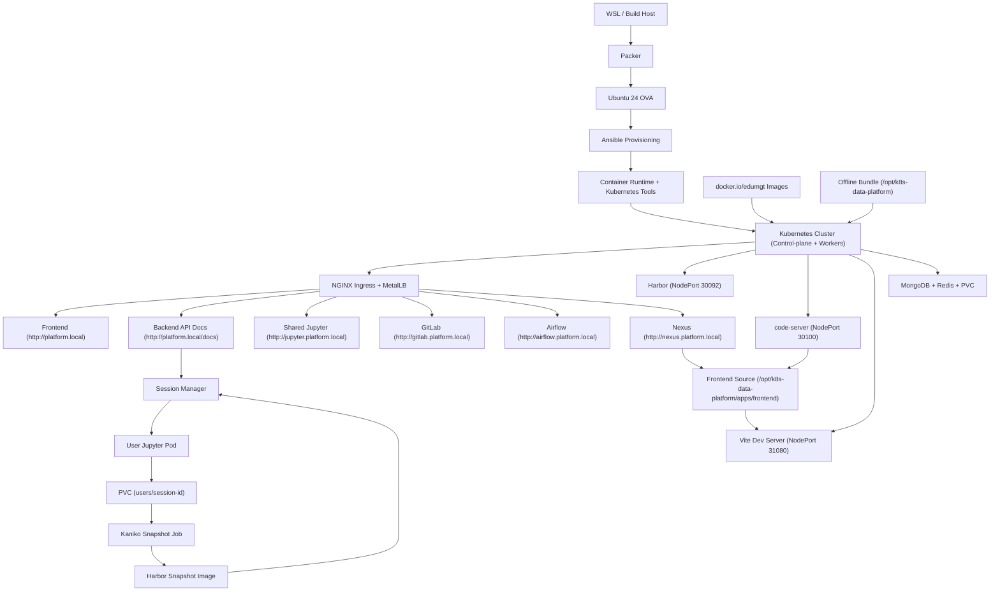
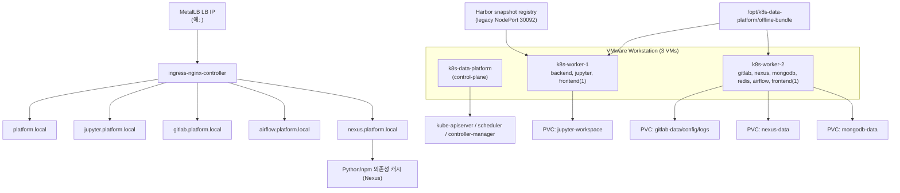
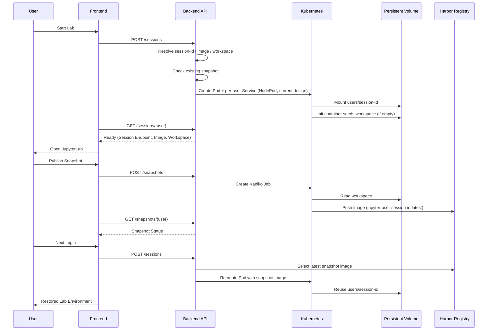
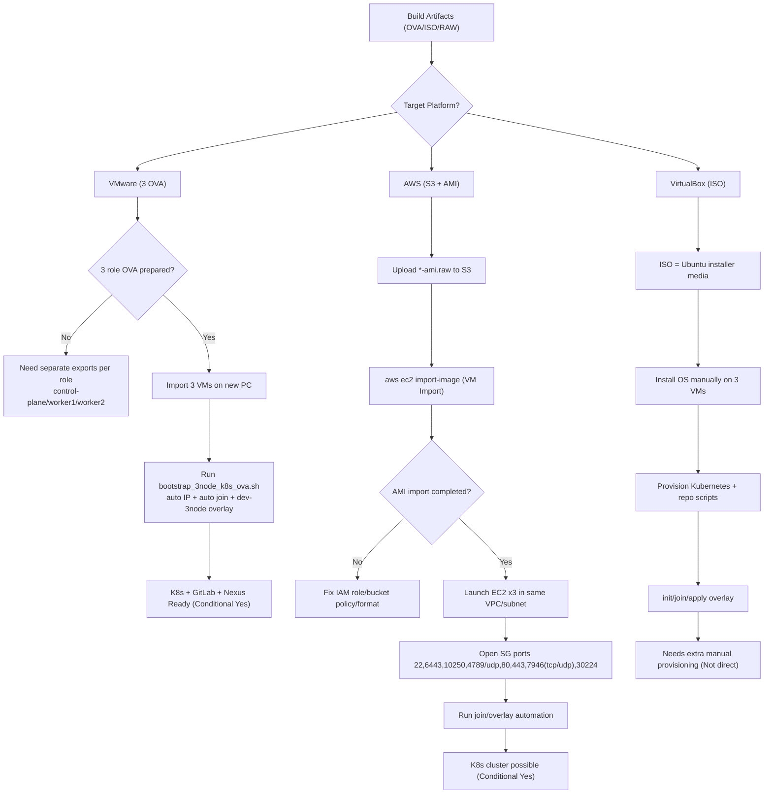
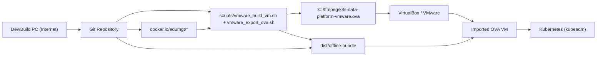
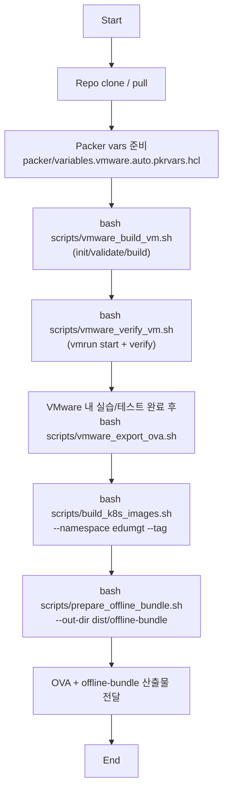
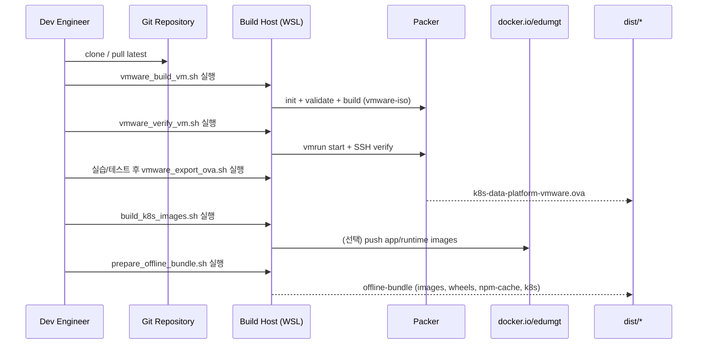
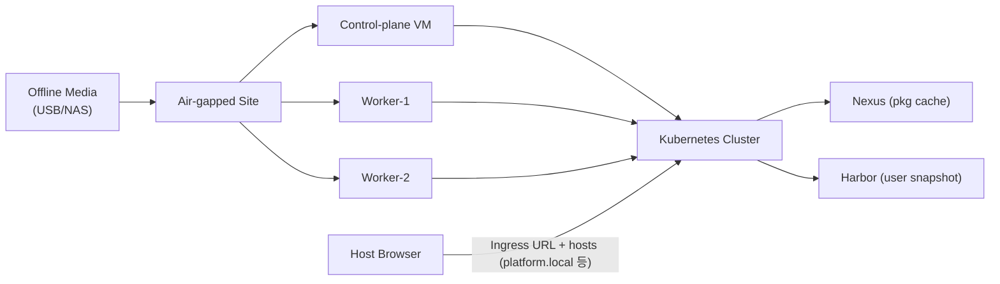
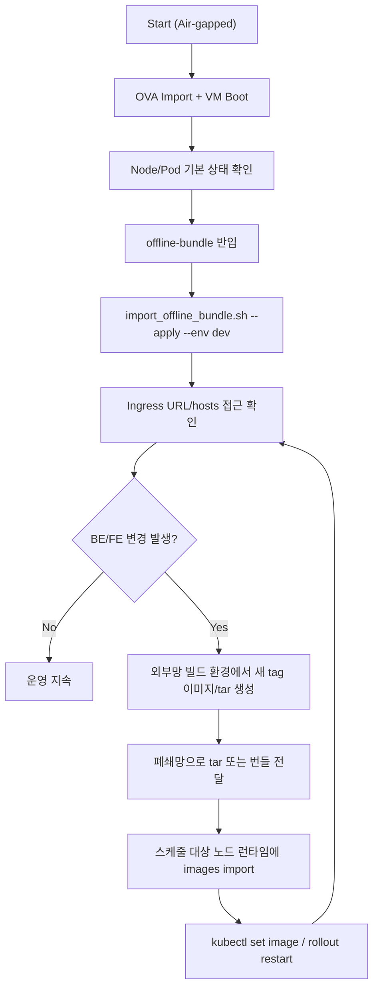
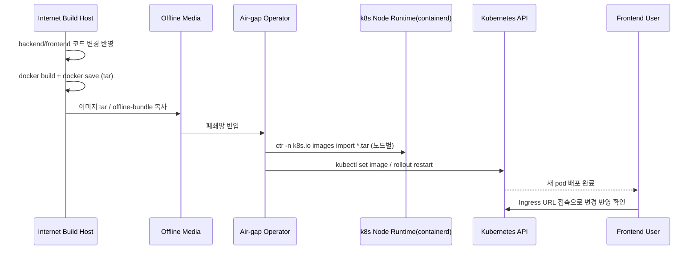

# k8s-data-platform-ova

🌐 [English](README.en.md) | [中文](README.zh.md) | [日本語](README.ja.md) | **한국어**

이 저장소는 `Ubuntu 24 OVA -> kubeadm Kubernetes(3-node 기본) -> platform workloads` 구조를 기준으로 만든 실습/운영용 플랫폼입니다. 현재 실행 기준은 Docker Compose 가 아니라 `Kubernetes manifest + kustomize overlay + kubeadm/bootstrap` 이며, OVA 안에 Docker Engine, containerd, kubeadm, kubelet, kubectl, vim, curl, Node.js, Python, 이미지 캐시, 오프라인 번들까지 미리 넣는 방향으로 정리했습니다.

추가로, 이 README는 기존 Kubernetes 중심 설명 위에 다음 운영 관점을 더 잘 보이도록 보강했습니다.

- OVA import 후 VMware 3-node 기준으로 바로 테스트 가능한 흐름 (VirtualBox 는 레거시 참고)
- 폐쇄망 환경에서의 서비스 접근 방식
- Frontend 개발 환경(`code-server`, `Vite`, `npm offline`) 사용 절차
- 오프라인 번들 import / 검증 체크리스트

핵심 요구 반영 사항은 아래와 같습니다.

- 사용자별 JupyterLab 세션을 Kubernetes Pod/Service 로 생성
- 사용자별 workspace 를 `PVC subPath` 로 지속화
- workspace 를 Kaniko Job 으로 Harbor snapshot 이미지화
- 다음 로그인 시 Harbor snapshot 이미지를 우선 선택해 재기동
- 플랫폼 공통 이미지는 기본값 기준 `harbor.local/data-platform/*` 에서 pull
- OVA 내부에 Docker Engine, 기본 유틸리티, 플랫폼 이미지, 오프라인 라이브러리 번들 선탑재

## VMware 멀티노드 바로 시작 (첫 실행 스크립트)

control-plane 1대 + worker 2대를 **가장 먼저 자동으로 올릴 때**는 아래 스크립트를 먼저 실행합니다.

#### packer 설치

```powershell
winget install Hashicorp.Packer
```

```bash
bash scripts/vmware_provision_3node.sh --vars-file packer/variables.vmware.auto.pkrvars.hcl
```

프로비저닝 + 솔루션 배치 검증(웹 접속 포함)까지는 루트의 `start.sh`를 사용합니다.

```bash
bash ./start.sh --vars-file packer/variables.vmware.auto.pkrvars.hcl
```

`start.sh`는 기본적으로 기존 VMX 3개가 이미 있으면 VM 삭제/packer 빌드를 하지 않고, VM 기동 후 Pod 배치/Ingress URL 검증(브라우저 접속 가능 여부 점검) 중심으로 실행합니다.

최종 OVA 3개 export는 루트 `ovabuild.sh`로 분리되었습니다.

```bash
bash ./ovabuild.sh \
  --vars-file packer/variables.vmware.auto.pkrvars.hcl \
  --control-plane-ip <YOUR_MASTER_IP> \
  --ingress-lb-ip <YOUR_LB_IP> \
  --dist-dir C:/ffmpeg
```

재부팅 복원 점검 + GitLab BE/FE demo repo seed까지 포함하려면:

```bash
bash ./start.sh \
  --vars-file packer/variables.vmware.auto.pkrvars.hcl \
  --seed-gitlab-be-fe \
  --post-reboot-check
```

PC 재기동 후 VMware에서 각 VM을 수동으로 Power On 한 다음, 재빌드 없이 현재 상태만 점검하려면:

```bash
bash scripts/vmware_post_reboot_verify.sh \
  --vars-file packer/variables.vmware.auto.pkrvars.hcl \
  --control-plane-ip <YOUR_MASTER_IP> \
  --ingress-lb-ip <YOUR_LB_IP>
```

Ingress URL 접근까지 한 번에 맞추려면(권장):

```bash
bash ./start.sh \
  --vars-file packer/variables.vmware.auto.pkrvars.hcl \
  --static-network \
  --control-plane-ip <YOUR_MASTER_IP> \
  --worker1-ip <YOUR_WORKER1_IP> \
  --worker2-ip <YOUR_WORKER2_IP> \
  --gateway <YOUR_GATEWAY_IP> \
  --metallb-range <YOUR_LB_IP>-<YOUR_LB_IP_END> \
  --ingress-lb-ip <YOUR_LB_IP>
```

폐쇄망 또는 외부 registry 접근이 불안정한 환경에서는, 먼저 오프라인 이미지 번들을 control-plane VM에 preload 한 뒤 `start.sh`를 실행하는 것을 권장합니다.

```bash
bash scripts/preload_offline_bundle_to_vm.sh \
  --control-plane-ip <YOUR_MASTER_IP> \
  --env dev
```

`init.sh`로 운영 흐름을 묶어서 실행하려면:

```bash
bash ./init.sh --preload-offline-bundle --preload-skip-build
```

이미지 preload 이후 클러스터 재구성까지 이어서 하려면:

```bash
bash ./init.sh --preload-offline-bundle --preload-skip-build --run-start -- --skip-export
```

오프라인 준비 상태를 점검하려면:

```bash
bash scripts/check_offline_readiness.sh
```

이 스크립트는 아래를 확인합니다.

- repo/bundle 내부 Calico, ingress-nginx, MetalLB, metrics-server 매니페스트 존재 여부
- containerd 에 핵심 `harbor.local/data-platform/*` 이미지가 preload 되어 있는지
- 현재 클러스터에 `ErrImagePull` / `ImagePullBackOff`가 남아 있는지

권장 순서:

1. `packer/variables.vmware.auto.pkrvars.hcl` 값 확인 (`iso_url`, `vmware_workstation_path`, `ovftool_path_windows`)
2. VMware Host-only 네트워크/Windows 어댑터/WSL route를 `<YOUR_SUBNET>` 기준으로 정리
3. 폐쇄망 대비가 필요하면 `bash scripts/preload_offline_bundle_to_vm.sh --control-plane-ip <YOUR_MASTER_IP> --env dev` 실행
4. `bash ./start.sh ... --metallb-range ... --ingress-lb-ip ...` 실행
5. hosts 파일 등록 (예: `<YOUR_LB_IP> platform.local jupyter.platform.local gitlab.platform.local airflow.platform.local nexus.platform.local`)
6. URL 접속 점검: `start.sh` 내부 `verify.sh` 결과 확인
7. (권장) control-plane VM에서 부팅 10분 후 자동 air-gap 점검 timer 설치
8. PC 재기동 후 수동 Power On 시 `bash scripts/vmware_post_reboot_verify.sh ...` 실행
9. 체크리스트 기반 마감: [CHECKLIST.md](CHECKLIST.md), [TODO.md](TODO.md)

자동 점검 timer 예시(control-plane VM 내부):

```bash
sudo bash /opt/k8s-data-platform/scripts/install_vm_airgap_postboot_timer.sh \
  --script-path /opt/k8s-data-platform/scripts/check_vm_airgap_status.sh \
  --expected-nodes k8s-data-platform,k8s-worker-1,k8s-worker-2,k8s-worker-3
```

- 동작: OS 부팅 후 10분에 1회 실행
- 점검 항목: node/pod 상태, image pull 오류, 외부 registry 참조(`docker.io`, `registry.k8s.io`, `ghcr.io`, `quay.io`), offline readiness

루트 문서 전체 안내는 [DOCS_MAP.md](DOCS_MAP.md)를 참고하세요.

## Kubernetes 구조 확인

현재 구조는 Kubernetes 가 맞습니다.

- 호스트 런타임: `Ubuntu 24`
- 클러스터: `kubeadm` 기반 Kubernetes (VMware 기본 흐름은 control-plane + worker 2대)
- 배포 기준: `infra/k8s/base` + `infra/k8s/overlays/dev|prod`
- 워크로드: `backend`, `frontend`, `mongodb`, `redis`, `airflow(optional)`, `jupyter`, `gitlab`, `gitlab-runner`, `nexus`
- 사용자 Jupyter 세션: backend 가 Kubernetes API 로 per-user Pod/Service 생성

즉, 이 저장소는 이미 Kubernetes 중심 구조였고, 이번 변경은 그 위에 `PVC subPath + snapshot publish/restore + registry/offline` 레이어를 보강한 것입니다.

## 구조 요약

```text
.
├── apps/
│   ├── airflow/          # Airflow image + DAG
│   ├── backend/          # FastAPI API + k8s session/snapshot control
│   ├── frontend/         # Quasar(Vue 3) dashboard
│   └── jupyter/          # JupyterLab image + bootstrap workspace
├── ansible/              # OVA guest provisioning, Docker/Kubernetes/bootstrap
├── infra/
│   ├── harbor/           # Harbor snapshot integration notes
│   └── k8s/              # base manifests + dev/prod overlays + runner overlay
├── packer/               # Ubuntu 24 OVA template
└── scripts/              # build/publish/apply/offline helper scripts
```

## 아키텍처 Flowchart



## 3-node 배치도 (VMware 기본)



## Jupyter Snapshot Sequence



## 사용자별 세션 규칙

공통 식별자 규칙은 [apps/backend/app/services/lab_identity.py](apps/backend/app/services/lab_identity.py) 에 모았습니다.

- `username` 정규화
- `session_id` 생성
- `pod_name`
- `service_name`
- `workspace_subpath`
- Harbor snapshot image 경로

이 규칙을 바탕으로:

- [apps/backend/app/services/jupyter_sessions.py](apps/backend/app/services/jupyter_sessions.py)
  가 Pod/Service/PVC mount 를 관리하고,
- [apps/backend/app/services/jupyter_snapshots.py](apps/backend/app/services/jupyter_snapshots.py)
  가 Kaniko snapshot publish/status/restore image 선택을 담당합니다.

## 이미지 전략

기본 운영 기준은 `harbor.local/data-platform/*` 입니다. 폐쇄망/air-gap 환경에서는 플랫폼 공통 이미지와 서드파티 런타임 이미지를 모두 내부 Harbor 기준으로 맞추고, 필요 시 오프라인 번들을 통해 control-plane 및 worker runtime 에 preload 합니다.

- platform app images
  - `harbor.local/data-platform/k8s-data-platform-backend:latest`
  - `harbor.local/data-platform/k8s-data-platform-frontend:latest`
  - `harbor.local/data-platform/k8s-data-platform-airflow:latest`
  - `harbor.local/data-platform/k8s-data-platform-jupyter:latest`
- mirrored runtime/base images
  - `harbor.local/data-platform/platform-python:*`
  - `harbor.local/data-platform/platform-node:*`
  - `harbor.local/data-platform/platform-nginx:*`
  - `harbor.local/data-platform/platform-mongodb:*`
  - `harbor.local/data-platform/platform-redis:*`
  - `harbor.local/data-platform/platform-gitlab-ce:*`
  - `harbor.local/data-platform/platform-gitlab-runner:*`
  - `harbor.local/data-platform/platform-kaniko-executor:*`

과거 `docker.io/edumgt/*` 경로는 번들 생성 소스 또는 호환용 미러 경로로만 취급하는 것이 안전합니다. 최종 배포/재사용 기준 YAML 과 preload 흐름은 Harbor-first 로 정리하는 것을 권장합니다.

## 빠른 시작 (VMware 기반 권장)

### 1. VMware 변수 준비

`packer/variables.vmware.auto.pkrvars.hcl`에서 아래 항목을 환경에 맞게 수정합니다.

- `iso_url`, `iso_checksum`
- `vm_name`, `output_directory`
- `vmware_workstation_path`, `ovftool_path_windows`

주의:
- `output_directory`는 `C:/ffmpeg` 같은 공용 루트가 아니라, 전용 하위 폴더(예: `C:/ffmpeg/output-k8s-data-platform-vmware`)를 사용하세요.
- 기존 출력 폴더가 이미 있으면 빌드가 실패할 수 있으므로 `--force`로 재실행하거나 폴더를 정리해야 합니다.

### 2. Step 1 - VMware VM 빌드 (export 없음)

```bash
bash scripts/vmware_build_vm.sh --vars-file packer/variables.vmware.auto.pkrvars.hcl
```

### 3. Step 2 - VM 부팅 + 기본 검증

```bash
bash scripts/vmware_verify_vm.sh \
  --vars-file packer/variables.vmware.auto.pkrvars.hcl \
  --vm-user ubuntu \
  --vm-password ubuntu \
  --env dev
```

### 4. Step 3 - VMware VM에서 실습/테스트 진행

- 필요한 기능 검증, 데이터 적재, 사용자 시나리오 테스트를 진행합니다.
- 폐쇄망에 배포할 최종 상태가 되면 다음 단계에서 OVA로 export 합니다.

### 5. Step 4 - 최종 OVA export

```bash
bash scripts/vmware_export_ova.sh \
  --vars-file packer/variables.vmware.auto.pkrvars.hcl \
  --dist-dir 'C:\ffmpeg'
```

산출물:

- `C:\ffmpeg\<vm_name>.ova`

### 6. 한 번에 실행 (빌드 + 검증 + export)

```bash
bash scripts/build_vmware_ova_and_verify.sh --vars-file packer/variables.vmware.auto.pkrvars.hcl
```

### 7. 원샷 3-node 자동 프로비저닝 (control-plane + worker-1 + worker-2)

아래 명령은 **control-plane 1대 빌드 + worker 2대 clone + 3대 부팅 + kubeadm join + dev-3node overlay + ingress-nginx/MetalLB**를 순차 실행합니다.
기본값으로 VMX를 VMware Workstation UI에 등록하므로, 실행 후 `My Computer` 목록에서 3대 VM을 확인할 수 있습니다.

```bash
bash scripts/vmware_provision_3node.sh --vars-file packer/variables.vmware.auto.pkrvars.hcl
```

이미 control-plane VM을 만들어 둔 상태에서 worker 2개만 새로 만들고,
VMware UI에 3대가 보이도록 빠르게 맞추려면:

```bash
bash scripts/vmware_provision_3node.sh \
  --vars-file packer/variables.vmware.auto.pkrvars.hcl \
  --skip-build \
  --force-recreate-workers \
  --skip-bootstrap \
  --vm-start-mode gui
```

기존 worker clone을 지우고 새로 만들려면:

```bash
bash scripts/vmware_provision_3node.sh --vars-file packer/variables.vmware.auto.pkrvars.hcl --force-recreate-workers
```

정적 IP까지 자동 적용하려면:

```bash
bash scripts/vmware_provision_3node.sh \
  --vars-file packer/variables.vmware.auto.pkrvars.hcl \
  --static-network \
  --control-plane-ip <YOUR_MASTER_IP> \
  --worker1-ip <YOUR_WORKER1_IP> \
  --worker2-ip <YOUR_WORKER2_IP> \
  --gateway <YOUR_GATEWAY_IP>
```

URL 접속까지 바로 맞추려면:

```bash
bash scripts/vmware_provision_3node.sh \
  --vars-file packer/variables.vmware.auto.pkrvars.hcl \
  --static-network \
  --control-plane-ip <YOUR_MASTER_IP> \
  --worker1-ip <YOUR_WORKER1_IP> \
  --worker2-ip <YOUR_WORKER2_IP> \
  --gateway <YOUR_GATEWAY_IP> \
  --metallb-range <YOUR_LB_IP>-<YOUR_LB_IP_END> \
  --ingress-lb-ip <YOUR_LB_IP>
```

3대 VM 사용/검증이 끝난 뒤 OVA 3개를 일괄 export하려면:

```bash
bash scripts/vmware_export_3node_ova.sh --vars-file packer/variables.vmware.auto.pkrvars.hcl --dist-dir 'C:\ffmpeg'
```

### VMware 실행 환경 정리 (WSL 기준)

- `scripts/vmware_build_vm.sh`, `scripts/vmware_verify_vm.sh`, `scripts/vmware_export_ova.sh`는 WSL에서 실행하도록 작성되어 있습니다.
- `scripts/vmware_provision_3node.sh`는 3-node(control-plane/worker1/worker2) 원샷 자동화를 제공합니다.
- `scripts/vmware_provision_3node.sh`는 기본적으로 VMX를 VMware UI에 등록하며, `--skip-workstation-register`로 비활성화할 수 있습니다.
- `scripts/vmware_provision_3node.sh`의 VM 부팅 모드는 `--vm-start-mode gui|nogui`로 제어할 수 있습니다.
- `scripts/vmware_export_3node_ova.sh`는 3대 VM OVA 일괄 export를 제공합니다.
- 내부적으로 `scripts/build_vmware_ova_and_verify.sh`를 호출합니다.
- `packer.exe`, `vmrun.exe`, `ovftool.exe`를 Windows 경로로 호출하는 구조입니다.

### 부가 산출물(OVA/ISO/qcow2/AMI) 일괄 생성

이 경로는 VMware 단계형 워크플로우와 별개로, 다중 산출물 생성이 필요한 경우 사용합니다.

```bash
bash scripts/build_packer_artifacts.sh --output-win-dir 'C:\ffmpeg'
```

기본 산출물:

- `C:\ffmpeg\k8s-data-platform.ova`
- `C:\ffmpeg\k8s-data-platform.iso`
- `C:\ffmpeg\k8s-data-platform.qcow2`
- `C:\ffmpeg\k8s-data-platform-ami.raw`
- `C:\ffmpeg\k8s-data-platform-ami-import.json`
- `C:\ffmpeg\k8s-data-platform-artifacts.sha256`
- `C:\ffmpeg\packer-cache\*` (Packer 캐시)

참고:

- 동일 파일이 이미 있으면 스크립트에서 자동으로 삭제 후 새로 생성합니다.
- `qemu-img`가 필요하므로 WSL에서 `qemu-utils` 설치가 선행되어야 합니다.
- Packer 템플릿은 OVA 생성 시 저장소를 VM 내부 `/home/ubuntu/Kubernetes-Jupyter-Sandbox`로 복제합니다.

```bash
sudo apt-get update
sudo apt-get install -y qemu-utils
```

이미 packer build를 끝낸 상태에서 변환/내보내기만 다시 할 때:

```bash
bash scripts/build_packer_artifacts.sh --skip-packer-build --output-win-dir 'C:\ffmpeg'
```

AWS AMI 등록은 생성된 `*-ami.raw`, `*-ami-import.json` 파일을 사용해 VM Import로 진행합니다.

### 2-3. 3-node OVA 완성 템플릿 (자동 IP + 자동 join + GitLab/Nexus 배치)

3-node 기준(Control-plane 1 + Worker 2)으로 Kubernetes 클러스터를 자동 구성하는 스크립트를 추가했습니다.

실제 추가된 폴더 구조:

```text
scripts/
├── bootstrap_3node_k8s_ova.sh
└── templates/
    └── 3node-cluster.env.example

infra/k8s/overlays/
└── dev-3node/
    ├── kustomization.yaml
    ├── local-pv.yaml
    └── node-placement-patch.yaml
```

`dev-3node` 배치 정책:

- `k8s-worker-1`: `backend`, `jupyter`
- `k8s-worker-2`: `gitlab`, `nexus`, `mongodb`, `redis`, `airflow`
- `frontend`: worker 노드 2개에 분산되도록 `replicas: 2` + topology spread 적용

#### 사전 조건

- control-plane VM은 이미 `kubeadm init` 완료 상태여야 함
- 2개 worker VM은 SSH 접속 가능해야 함
- 실행 위치는 WSL/Linux 운영 노드
- 비밀번호 SSH 자동화를 쓰면 `sshpass` 필요

```bash
sudo apt-get update
sudo apt-get install -y sshpass
```

#### 실행 방법

1) 템플릿 복사 후 환경값 수정

```bash
cp scripts/templates/3node-cluster.env.example /tmp/3node-cluster.env
vi /tmp/3node-cluster.env
```

2) 자동 구성 실행

```bash
bash scripts/bootstrap_3node_k8s_ova.sh --config /tmp/3node-cluster.env
```

스크립트 동작:

1. 3개 노드 netplan static IP 설정
2. hostname + `/etc/hosts` 동기화
3. worker 노드 `kubeadm join` 자동 수행
4. `dev-3node` overlay 자동 적용(`APPLY_OVERLAY=1` 기본)
5. ingress-nginx + MetalLB + metrics-server + Headlamp 구성 후 URL 엔드포인트(`platform.local`, `gitlab.platform.local`, `nexus.platform.local`) 확인

모듈 스택만 다시 적용하려면:

```bash
bash scripts/setup_k8s_modern_stack.sh \
  --metallb-range <YOUR_LB_IP>-<YOUR_LB_IP_END> \
  --ingress-lb-ip <YOUR_LB_IP>
```

### nexus.platform.local / admin / Edumgt22509741!
### gitlab.platform.local / root / Edumgt22509741!

#### 자주 쓰는 옵션(환경파일 값)

- `SKIP_NETWORK=1`: 이미 static IP가 설정된 경우 네트워크 단계만 건너뜀
- `SKIP_JOIN=1`: 이미 join 완료된 경우 join 단계만 건너뜀
- `OVERLAY=dev-3node`: 3-node 전용 오버레이 적용(기본값)
- `REMOTE_REPO_ROOT=/opt/k8s-data-platform`: OVA 내부 repo 경로(기본값)

### 2-4. 멀티 타깃 배포 가능성 기술 체크 (VMware/AWS/ISO)

아래는 질문한 4가지 경로를 repo 현재 구조 기준으로 점검한 결과입니다.

| 시나리오 | 결론 | 핵심 조건 |
|---|---|---|
| 다른 PC VMware에 OVA 3개 올려 3-node 구성 | 조건부 가능 | 3개 OVA가 각각 control-plane/worker1/worker2 역할이어야 함, IP/SSH 경로 확보 후 `bootstrap_3node_k8s_ova.sh` 실행 |
| `*-ami.raw`를 S3 업로드 후 AMI 등록, EC2 기동 | 조건부 가능 | AWS VM Import 권한/역할(`vmimport`)과 S3 버킷 준비, import 완료 후 AMI로 인스턴스 기동 |
| EC2 VM 3대로 kubeadm 클러스터링 | 조건부 가능 | VPC/SG에서 `6443`, `10250`, CNI 포트(Calico VXLAN 기본 `4789/udp`) 및 SSH 허용, control-plane에서 worker join 수행 |
| ISO 3개를 VirtualBox에 올려 바로 3-node 구성 | 바로는 불가 | 현재 생성 ISO는 Ubuntu 설치 ISO 복사본이며 pre-provisioned 이미지가 아님. OS 설치 + kubeadm/init/join + overlay 적용이 추가로 필요 |

중요:

- `scripts/build_packer_artifacts.sh`는 기본적으로 `k8s-data-platform.ova` 1개를 생성합니다.
- VMware에서 3 OVA를 바로 쓰려면 role별 VM(예: `k8s-data-platform`, `k8s-worker-1`, `k8s-worker-2`)을 별도로 export해 준비해야 합니다.

#### 전체 판단 흐름 (Mermaid)



#### 경로별 상세 체크포인트

1. VMware 3 OVA

- 각 VM hostname/IP가 고유해야 함 (`k8s-data-platform`, `k8s-worker-1`, `k8s-worker-2`)
- control-plane에서 다음 확인:

```bash
sudo KUBECONFIG=/etc/kubernetes/admin.conf kubectl get nodes -o wide
sudo KUBECONFIG=/etc/kubernetes/admin.conf kubectl get pods -n data-platform-dev -o wide
sudo KUBECONFIG=/etc/kubernetes/admin.conf kubectl get svc -n data-platform-dev
```

2. AWS AMI/EC2

- 산출물: `k8s-data-platform-ami.raw`, `k8s-data-platform-ami-import.json`
- 예시 흐름:

```bash
aws s3 cp C:/ffmpeg/k8s-data-platform-ami.raw s3://<bucket>/k8s-data-platform-ami.raw
aws ec2 import-image --region <region> --disk-containers file://C:/ffmpeg/k8s-data-platform-ami-import.json
aws ec2 describe-import-image-tasks --region <region> --import-task-ids <task-id>
```

- AMI 생성 후 EC2 3대를 같은 VPC 네트워크에 띄운 뒤 `bootstrap_3node_k8s_ova.sh` 패턴으로 join/overlay 적용

3. ISO 3개 VirtualBox

- 현재 ISO는 설치 미디어 성격이라 앱/클러스터가 선탑재된 VM 이미지가 아님
- 즉, ISO 경로는 가능은 하지만 "설치 자동화(autoinstall + ansible + kubeadm)"까지 별도로 설계해야 운영 수준 재현 가능

### 3. Docker Hub mirror + local Kubernetes runtime import

로컬 Docker login 상태를 사용해서 `edumgt` 네임스페이스 기준으로 support/app 이미지를 정리합니다.

```bash
bash scripts/build_k8s_images.sh --namespace edumgt --tag latest
```

Docker Hub push 까지 하려면:

```bash
docker login
bash scripts/publish_dockerhub.sh --namespace edumgt --tag latest
```

### 4. Kubernetes 적용

```bash
bash scripts/apply_k8s.sh --env dev
```

초기화 후 재적용:

```bash
bash scripts/reset_k8s.sh --env dev
bash scripts/apply_k8s.sh --env dev
```

상태 확인:

```bash
bash scripts/status_k8s.sh --env dev
```

### 4-1. Kubernetes v1.35.3 상세 설치/업그레이드 (4-node VMware 실습 기준)

검증 기준(2026-04-06):

- control-plane: `k8s-data-platform` (`<YOUR_MASTER_IP>`)
- worker: `k8s-worker-1` (`<YOUR_WORKER1_IP>`)
- worker: `k8s-worker-2` (`<YOUR_WORKER2_IP>`)
- worker: `k8s-worker-3` (`<YOUR_WORKER_ML1_IP>`)
- SSH: `disadm@<node> -p 10022`

패키지 고정:

- `kubeadm_1.35.3-1.1_amd64.deb`
- `kubelet_1.35.3-1.1_amd64.deb`
- `kubectl_1.35.3-1.1_amd64.deb`
- 배치 경로: `/opt/k8s-upgrade-1.35.3/`

주의:

- `ens33`를 외부망 기본 경로로 쓰더라도 `ens160`의 `<YOUR_SUBNET>.x` 고정 IP를 제거하면 안 됩니다.
- etcd/Harbor 접근이 `<YOUR_SUBNET>.x`에 의존하는 경우가 있어, `ens160`은 보조 경로(metric 높게)로 유지해야 합니다.

#### A) NIC/netplan 정렬 (`ens33` 우선 + `ens160` 유지)

1. 각 노드에 `ens33` DHCP 설정 추가:

```bash
cat <<'EOF' | sudo tee /etc/netplan/97-ens33-dhcp.yaml >/dev/null
network:
  version: 2
  renderer: networkd
  ethernets:
    ens33:
      dhcp4: true
      dhcp-identifier: mac
      optional: true
      dhcp4-overrides:
        route-metric: 10
EOF
sudo chmod 600 /etc/netplan/97-ens33-dhcp.yaml
```

2. `ens160` 고정 IP를 노드별로 유지(예시: control-plane):

```bash
cat <<'EOF' | sudo tee /etc/netplan/99-k8s-data-platform-static.yaml >/dev/null
network:
  version: 2
  renderer: networkd
  ethernets:
    ens160:
      dhcp4: false
      addresses:
        - <YOUR_MASTER_IP>/24
      routes:
        - to: default
          via: <YOUR_GATEWAY_IP>
          metric: 500
      nameservers:
        addresses: [<YOUR_GATEWAY_IP>, 1.1.1.1, 8.8.8.8]
EOF
sudo chmod 600 /etc/netplan/99-k8s-data-platform-static.yaml
sudo netplan generate && sudo netplan apply
```

3. 최종 확인:

```bash
ip -4 -br a | egrep 'ens160|ens32|ens33'
ip route | egrep 'default|<YOUR_SUBNET>'
```

#### B) 사전 점검 (control-plane)

```bash
sudo kubeadm version -o short
sudo KUBECONFIG=/etc/kubernetes/admin.conf kubectl get nodes -o wide
sudo kubeadm upgrade plan v1.35.3
sudo kubeadm config images pull --kubernetes-version v1.35.3
```

#### C) control-plane 업그레이드

```bash
sudo kubeadm upgrade apply -y v1.35.3
sudo dpkg -i \
  /opt/k8s-upgrade-1.35.3/kubelet_1.35.3-1.1_amd64.deb \
  /opt/k8s-upgrade-1.35.3/kubectl_1.35.3-1.1_amd64.deb
sudo systemctl daemon-reload
sudo systemctl restart kubelet
```

#### D) worker 순차 업그레이드 (drain -> upgrade -> uncordon)

control-plane에서 실행:

```bash
for NODE in k8s-worker-1 k8s-worker-2 k8s-worker-3; do
  sudo KUBECONFIG=/etc/kubernetes/admin.conf kubectl drain "${NODE}" \
    --ignore-daemonsets --delete-emptydir-data --force --grace-period=30 --timeout=180s

  NODE_IP=""
  if [ "${NODE}" = "k8s-worker-1" ]; then NODE_IP="<YOUR_WORKER1_IP>"; fi
  if [ "${NODE}" = "k8s-worker-2" ]; then NODE_IP="<YOUR_WORKER2_IP>"; fi
  if [ "${NODE}" = "k8s-worker-3" ]; then NODE_IP="<YOUR_WORKER_ML1_IP>"; fi

  ssh -p 10022 disadm@"${NODE_IP}" "
    sudo kubeadm upgrade node &&
    sudo dpkg -i /opt/k8s-upgrade-1.35.3/kubelet_1.35.3-1.1_amd64.deb /opt/k8s-upgrade-1.35.3/kubectl_1.35.3-1.1_amd64.deb &&
    sudo systemctl daemon-reload &&
    sudo systemctl restart kubelet
  "

  sudo KUBECONFIG=/etc/kubernetes/admin.conf kubectl uncordon "${NODE}"
done
```

#### E) 업그레이드 중 `etcd context deadline exceeded` 대응

증상:

- `kubeadm upgrade apply` 중 `failed to create etcd client: ... context deadline exceeded`

주요 원인:

- etcd advertise 주소(`<YOUR_MASTER_IP>`)와 etcd server/peer 인증서 SAN 불일치
- `ens160` 고정 주소 유실로 기존 etcd endpoint(`<YOUR_MASTER_IP>`) 단절

점검:

```bash
sudo sed -n '1,120p' /etc/kubernetes/manifests/etcd.yaml
sudo openssl x509 -in /etc/kubernetes/pki/etcd/server.crt -noout -text | sed -n '/Subject Alternative Name/,+1p'
```

보정(필요 시):

```bash
cat <<'EOF' | sudo tee /tmp/kubeadm-etcd-certfix.yaml >/dev/null
apiVersion: kubeadm.k8s.io/v1beta4
kind: InitConfiguration
localAPIEndpoint:
  advertiseAddress: <YOUR_MASTER_IP>
  bindPort: 6443
nodeRegistration:
  name: k8s-data-platform
  criSocket: unix:///run/containerd/containerd.sock
---
apiVersion: kubeadm.k8s.io/v1beta4
kind: ClusterConfiguration
kubernetesVersion: v1.35.3
controlPlaneEndpoint: <YOUR_MASTER_IP>:6443
etcd:
  local:
    serverCertSANs:
      - <YOUR_MASTER_IP>
      - <YOUR_MASTER_IP>
      - 127.0.0.1
    peerCertSANs:
      - <YOUR_MASTER_IP>
      - <YOUR_MASTER_IP>
      - 127.0.0.1
EOF

sudo rm -f /etc/kubernetes/pki/etcd/server.crt /etc/kubernetes/pki/etcd/server.key
sudo rm -f /etc/kubernetes/pki/etcd/peer.crt /etc/kubernetes/pki/etcd/peer.key
sudo kubeadm init phase certs etcd-server --config /tmp/kubeadm-etcd-certfix.yaml
sudo kubeadm init phase certs etcd-peer --config /tmp/kubeadm-etcd-certfix.yaml
sudo crictl stop "$(sudo crictl ps --name etcd -q | head -n1)"
```

이후 `sudo kubeadm upgrade apply -y v1.35.3` 재실행.

#### F) 최종 검증

```bash
sudo KUBECONFIG=/etc/kubernetes/admin.conf kubectl get nodes -o wide
sudo KUBECONFIG=/etc/kubernetes/admin.conf kubectl get pods -A --field-selector=status.phase!=Running,status.phase!=Succeeded
```

기대값:

- 모든 노드 `Ready`, `VERSION=v1.35.3`
- 비정상 phase Pod 없음

참고:

- 업그레이드 직후 `calico-kube-controllers`가 `ImagePullBackOff`면 재스케줄로 복구되는 경우가 있습니다.

```bash
sudo KUBECONFIG=/etc/kubernetes/admin.conf kubectl -n kube-system delete pod -l k8s-app=calico-kube-controllers
```

### 5. GitLab Runner overlay

```bash
bash scripts/apply_k8s.sh --env dev --with-runner
kubectl scale deployment/gitlab-runner -n data-platform-dev --replicas=1
```

### 5-1. BE/FE Minor Version Bump

BE, FE 소스에 작은 변경이 있을 때 버전을 `0.1` 단위(semver minor)로 함께 올리려면:

```bash
bash scripts/bump_be_fe_minor_version.sh
```

예시:
- `backend 0.2.0 -> 0.3.0`
- `frontend 0.2.0 -> 0.3.0`

### 6. Nexus Offline Repository

PyPI 와 npm 의 폐쇄망 캐시는 Nexus 로 관리하도록 보강했습니다.

```bash
bash scripts/apply_k8s.sh --env dev
bash scripts/setup_nexus_offline.sh --namespace data-platform-dev --nexus-url http://nexus.platform.local
```

참고:
- control-plane VM 내부에서 실행하면 `--nexus-url http://127.0.0.1:30091` 로도 동작합니다.

이미 초기화된 Nexus(admin 비밀번호 변경 상태)에서 재실행할 때:

```bash
bash scripts/setup_nexus_offline.sh \
  --namespace data-platform-dev \
  --nexus-url http://nexus.platform.local \
  --current-password '<current-admin-password>' \
  --target-password '<new-admin-password>' \
  --username admin \
  --password '<new-admin-password>'
```

Backend Python + Vue3/Quasar 개발용 라이브러리까지 미리 워밍하려면:

```bash
bash scripts/setup_nexus_offline.sh \
  --namespace data-platform-dev \
  --nexus-url http://nexus.platform.local \
  --username admin \
  --password '<nexus-password>' \
  --python-seed-file scripts/offline/python-dev-seed.txt \
  --npm-seed-file scripts/offline/npm-dev-seed.txt
```

의존성 접근 검증:

```bash
bash scripts/verify_nexus_dependencies.sh \
  --nexus-url http://nexus.platform.local \
  --username admin \
  --password '<nexus-password>'
```

폐쇄망 장기 운영을 위해 기본 PVC 요청 용량도 상향했습니다.
- `nexus-data`: `80Gi`
- `gitlab-data`: `60Gi`
- `gitlab-config`, `gitlab-logs`: 각 `10Gi`
- `jupyter-workspace`: `10Gi`

코드 기준으로 Docker Hub 와 Harbor 사용 범위를 다시 확인하려면:

```bash
bash scripts/audit_registry_scope.sh
```

## OVA Import 후 테스트 (VMware 3-node 기준)

현재 기본 사용 시나리오는 **VMware Workstation + 3개 VM(control-plane 1, worker 2)** 입니다.

상세 가이드는 [docs/vmware/README.md](docs/vmware/README.md)를 참고하세요.

### 1) Source Host 에서 3개 OVA export

```bash
bash scripts/vmware_export_3node_ova.sh \
  --vars-file packer/variables.vmware.auto.pkrvars.hcl \
  --dist-dir 'C:\ffmpeg'
```

### 2) Target Host VMware import

1. VMware Workstation에서 `File > Open`으로 OVA 3개를 각각 import
2. VM 이름을 역할별로 유지 (`k8s-data-platform`, `k8s-worker-1`, `k8s-worker-2`)
3. Network는 같은 테스트망(Bridged/NAT 고정 정책 중 하나)으로 통일
4. 3대 VM 부팅 후 SSH/네트워크 도달성 확인

권장 사양(호스트 기준):

- CPU 8 core 이상
- Memory 32GB 이상
- Disk 200GB 이상

### 3) 부팅 후 기본 확인

control-plane VM에서:

```bash
sudo KUBECONFIG=/etc/kubernetes/admin.conf kubectl get nodes -o wide
sudo KUBECONFIG=/etc/kubernetes/admin.conf kubectl get pods -n data-platform-dev -o wide
sudo KUBECONFIG=/etc/kubernetes/admin.conf kubectl get svc -n data-platform-dev
sudo KUBECONFIG=/etc/kubernetes/admin.conf kubectl get ingress -n data-platform-dev
```

Ingress 점검:

```bash
bash scripts/verify.sh --http-mode ingress --lb-ip <YOUR_LB_IP>
```

### 4) 웹 접속 확인 (Ingress URL)

- Frontend: `http://platform.local`
- Backend docs: `http://platform.local/docs`
- Jupyter: `http://jupyter.platform.local/lab`
- GitLab: `http://gitlab.platform.local`
- Airflow: `http://airflow.platform.local`
- Nexus: `http://nexus.platform.local`
- Headlamp: `http://headlamp.platform.local`

레거시 NodePort(필요 시):

- Harbor snapshot registry: `http://<CONTROL_PLANE_IP>:30092`
- code-server: `http://<CONTROL_PLANE_IP>:30100`
- Frontend Dev: `http://<CONTROL_PLANE_IP>:31080`

hosts 파일 예시(Windows):

```text
<YOUR_LB_IP> platform.local
<YOUR_LB_IP> jupyter.platform.local
<YOUR_LB_IP> gitlab.platform.local
<YOUR_LB_IP> airflow.platform.local
<YOUR_LB_IP> nexus.platform.local
<YOUR_LB_IP> headlamp.platform.local
```

## 관리자 계정 / 비밀번호 정리 (현재 기본 실행값)

`bash ./start.sh --vars-file packer/variables.vmware.auto.pkrvars.hcl` + `dev-3node` overlay 기준입니다. 운영 중 값이 변경되었으면 실제 cluster secret 값이 우선합니다.

| 솔루션 | 접속 주소 | 관리자 ID | 비밀번호/토큰 | 근거 |
|---|---|---|---|---|
| VMware VM SSH (control-plane/worker) | SSH (`22`) | `ubuntu` | `CHANGE_ME` | `packer/variables.vmware.auto.pkrvars.hcl` |
| Platform Web(Admin 모드) | `http://platform.local` | `admin@test.com` | `CHANGE_ME` | `apps/backend/app/services/demo_users.py` |
| Control-plane 전용 로그인(대체 계정) | `http://platform.local/#control-plane` | `platform-admin` | `CHANGE_ME` | `infra/k8s/overlays/dev-3node/platform-secrets-patch.yaml` |
| JupyterLab(shared) | `http://jupyter.platform.local/lab` | `token` | `CHANGE_ME` | `infra/k8s/overlays/dev-3node/platform-secrets-patch.yaml` |
| GitLab (root) | `http://gitlab.platform.local` | `root` | `CHANGE_ME` | `GITLAB_ROOT_PASSWORD` (dev overlay) |
| Airflow | `http://airflow.platform.local` | `admin` | `CHANGE_ME` | `AIRFLOW_ADMIN_USERNAME/PASSWORD` (dev overlay) |
| Nexus Repository | `http://nexus.platform.local` | `admin` | `CHANGE_ME` | `start.sh` 기본값 + `PLATFORM_NEXUS_ADMIN_PASSWORD` |
| Harbor Snapshot Registry | `http://<CONTROL_PLANE_IP>:30092` | `PLATFORM_HARBOR_USER` | `PLATFORM_HARBOR_PASSWORD` | base secret 기본값은 `CHANGE_ME` |

`prod` overlay는 별도 계정/비밀번호를 사용합니다: `infra/k8s/overlays/prod/platform-secrets-patch.yaml`.

보안 권장: 실환경 배포 시 위 기본 비밀번호는 반드시 교체하세요.

## Frontend / API

- Frontend 로그인 계정
  - user: `test1@test.com / CHANGE_ME`
  - user: `test2@test.com / CHANGE_ME`
  - admin: `admin@test.com / CHANGE_ME`
- 로그인은 JWT 기반 modal UI로 먼저 수행
- 일반 사용자는 로그인 후 본인 전용 Jupyter sandbox 만 시작/중지/복원
- 일반 사용자는 본인 Jupyter 사용 이력(로그인/실행 횟수, 현재/누적 사용시간)을 확인
- 관리자는 AG Grid CE 기반 사용자 목록으로 sandbox 상태/사용 지표를 모니터링
- Backend API:
  - `POST /api/auth/login`
  - `GET /api/auth/me`
  - `POST /api/auth/logout`
  - `GET /api/users/me/usage`
  - `POST /api/jupyter/sessions`
  - `GET /api/jupyter/sessions/{username}`
  - `DELETE /api/jupyter/sessions/{username}`
  - `GET /api/jupyter/snapshots/{username}`
  - `POST /api/jupyter/snapshots`
  - `GET /api/admin/sandboxes`

Frontend 는 로그인 모드에 따라 사용자용(Jupyter 작업 + 내 사용 이력) 또는 관리자용(AG Grid CE 사용자 목록 + control-plane) 화면으로 분기됩니다.

Airflow 는 현재 `platform_health_check` DAG 기반의 샘플 오케스트레이션 역할이며, Jupyter sandbox / GitLab / offline bundle 핵심 경로에는 필수는 아닙니다. 폐쇄망 최소 실행용으로는 backend 와 frontend 를 하나의 pod 로 묶은 offline suite 도 추가했습니다.

## Frontend 개발 환경

이 OVA 는 운영 Frontend 뿐 아니라 **폐쇄망 내 Vue 개발 환경**도 함께 제공합니다.

구성은 다음과 같습니다.

- 운영 Frontend/API: Ingress URL `platform.local`
- 개발 Frontend: Vite dev server `31080`
- IDE: `code-server` `30100`
- 패키지 공급: Nexus npm registry + offline npm cache

### code-server 접속

```text
http://<OVA_IP>:30100
```

로그인 후 다음 경로를 엽니다.

```text
/opt/k8s-data-platform/apps/frontend
```

### 의존성 설치

```bash
bash /opt/k8s-data-platform/scripts/frontend_dev_setup.sh
```

인증이 필요한 Nexus 인 경우:

```bash
bash /opt/k8s-data-platform/scripts/frontend_dev_setup.sh \
  --registry http://nexus.platform.local/repository/npm-all/ \
  --username admin \
  --password '<nexus-password>'
```

동작 우선순위:

1. Nexus npm registry 사용
2. 실패 시 offline npm cache 사용

수동 설정 예시:

```bash
npm config set registry http://nexus.platform.local/repository/npm-group/
```

### 개발 서버 실행

```bash
bash /opt/k8s-data-platform/scripts/run_frontend_dev.sh
```

브라우저 접속:

```text
http://<OVA_IP>:31080
```

### Backend API 연동 예시

```bash
VITE_API_BASE_URL=http://platform.local
```

### Frontend 협업 예시

```bash
git clone http://gitlab.platform.local/dev2/platform-frontend.git
cd platform-frontend
git add .
git commit -m "update"
git push origin main
```

### Demo Screenshots

JWT modal 로그인 화면:


`test1@test.com` 사용자의 본인 계정 Jupyter 사용 이력 카드:


`admin@test.com` 관리자의 AG Grid CE 사용자 목록:


`test1@test.com` 사용자가 본인 sandbox JupyterLab에 접속해 `print("hello world")` 결과를 확인하는 화면:


`admin@test.com` 관리자가 관리자 모드로 접속해 현재 실행 중인 사용자 수를 보는 monitoring 대시보드:


### GitLab Public Repo Demo

실행 중인 GitLab pod 에 demo 계정과 공개 repo 를 만들어 `apps/backend`, `apps/frontend` 를 app repo 로 분리해 push/pull 하는 흐름도 재현했습니다.

- GitLab demo user: `dev1@dev.com / CHANGE_ME`
- GitLab demo user: `dev2@dev.com / CHANGE_ME`
- public repo: `dev1/platform-backend`
- public repo: `dev2/platform-frontend`

`dev1` 이 backend public repo 를 소유하고 있는 GitLab 화면:


`dev2` 가 frontend public repo 를 소유하고 있는 GitLab 화면:


backend repo 를 `dev1` 이 push 하고, `dev2` clone 후 update 를 `git pull` 로 가져오는 흐름:


frontend repo 를 `dev2` 가 push 하고, `dev1` clone 후 update 를 `git pull` 로 가져오는 흐름:


### GitLab/Nexus 점검 캡처 (Playwright, 2026-03-26)

`test1@test.com` 계정의 공개 프로젝트(`apps-backend`, `apps-frontend`) 존재 확인:


Nexus `pypi-hosted` 라이브러리 적재 확인(REST 조회 결과를 Playwright로 캡처):


재현 명령:

```bash
bash scripts/demo_gitlab_repo_flow.sh
source dist/gitlab-demo/gitlab-demo.env
CAPTURE_TARGETS=gitlab-backend-repo,gitlab-frontend-repo,backend-git-flow,frontend-git-flow \
  PLAYWRIGHT_IMAGE=local/playwright-runner:latest \
  bash scripts/capture_k8s_screenshots.sh
```

## 폐쇄망 / OVA 준비

OVA provisioning 시 아래 항목을 미리 넣도록 구성했습니다.

- Docker Engine
- containerd
- kubeadm
- kubelet
- kubectl
- Python 3.12 tooling
- Node.js 22
- vim, curl, git, jq, rsync, zip, unzip, wget
- `/opt/k8s-data-platform/scripts`
- `/opt/k8s-data-platform/docs`
- `/opt/k8s-data-platform/apps/frontend`
- `code-server`
- platform/app images preload
- `/opt/k8s-data-platform/offline-bundle`

오프라인 번들을 수동으로 다시 만들려면:

```bash
bash scripts/prepare_offline_bundle.sh --out-dir dist/offline-bundle
```

번들 내용:

- `images/`: Docker load / Kubernetes container runtime import 용 tar archives
- `wheels/`: backend/jupyter/airflow Python wheel cache
- `npm-cache/`: frontend npm cache
- `frontend-package-lock.json`: frontend offline rebuild 기준 lockfile
- `k8s/`: offline apply/import 용 manifests, helper scripts, 운영 문서

폐쇄망 최소 stack(one-pod backend/frontend + Nexus cache) 을 적용하려면:

```bash
bash scripts/apply_offline_suite.sh
```

오프라인 번들로 이미지 import 와 k8s 적용까지 진행하려면:

```bash
bash scripts/import_offline_bundle.sh --bundle-dir dist/offline-bundle --apply --env dev
```

## 외부망 초기 구성 / 폐쇄망 전환 다이어그램

아래 다이어그램은 다음 2가지 운영 구간을 분리해 설명합니다.

- `A`: 외부망에서 최초 OVA/이미지/번들을 준비하는 구간
- `B`: OVA 복제 후 폐쇄망에서 서비스 기동/업데이트를 수행하는 구간

### A) 외부망 최초 구성 (Seed Build) 아키텍처



### A-1) 외부망 최초 구성 순서도



### A-2) 외부망 최초 구성 시퀀스



### B) OVA 복제 후 폐쇄망 구성 아키텍처



### B-1) 폐쇄망 운영 순서도



### B-2) 폐쇄망 BE/FE 변경 반영 시퀀스



### 폐쇄망 BE/FE 변경 운영 규칙

- `docker.io` pull/push가 막혀 있으면, 이미지는 `tar` 반입 + `ctr images import`로 배포합니다.
- `frontend`가 여러 worker에 스케줄되면, 해당 worker 모두에 같은 태그 이미지를 import 해야 합니다.
- `imagePullPolicy: IfNotPresent` 전략을 유지하면 로컬 런타임 캐시 이미지를 우선 사용합니다.
- URL 진입점은 `Ingress + MetalLB`로 고정하고, hosts 파일(`platform.local` 등)을 운영 기준으로 유지합니다.
- `latest` 고정보다 버전 태그(`2026.03.19-1` 등) 사용이 롤백/추적에 유리합니다.

예시(외부망 빌드 환경):

```bash
IMAGE_TAG=2026.03.19-1
bash scripts/build_k8s_images.sh --namespace edumgt --tag "${IMAGE_TAG}" --skip-runtime-import
bash scripts/prepare_offline_bundle.sh --out-dir dist/offline-bundle --namespace edumgt --tag "${IMAGE_TAG}"
```

예시(폐쇄망 적용 환경):

```bash
bash /opt/k8s-data-platform/scripts/import_offline_bundle.sh \
  --bundle-dir /opt/k8s-data-platform/offline-bundle \
  --apply --env dev
```

BE/FE만 수동 롤링 갱신할 때:

```bash
sudo ctr -n k8s.io images import backend.tar
sudo ctr -n k8s.io images import frontend.tar

sudo KUBECONFIG=/etc/kubernetes/admin.conf kubectl -n data-platform-dev \
  set image deploy/backend backend=docker.io/edumgt/k8s-data-platform-backend:2026.03.19-1

sudo KUBECONFIG=/etc/kubernetes/admin.conf kubectl -n data-platform-dev \
  set image deploy/frontend frontend=docker.io/edumgt/k8s-data-platform-frontend:2026.03.19-1
```

## 오프라인 사용 전략

폐쇄망 환경에서는 다음 순서로 동작하는 것을 기본값으로 봅니다.

1. OVA 내부 preload 이미지와 도구로 기본 클러스터 기동
2. `offline-bundle` 을 이용해 필요한 이미지/패키지 import
3. Nexus 로 Python / npm 패키지 캐시 제공
4. Harbor 는 사용자 snapshot 저장소로 활용
5. 사용자 접속은 `Ingress URL + hosts 파일` 기준으로 접근

즉, 인터넷 연결 없이도 다음이 가능해야 합니다.

- 플랫폼 서비스 기동
- 사용자별 Jupyter 세션 생성/복원
- GitLab 저장소 clone/push
- Frontend 의존성 설치 및 Vite 실행
- Harbor snapshot publish/restore

## GitHub Actions

변경된 컨테이너 자산을 Docker Hub 로 보내는 workflow 를 추가했습니다.

- workflow: [.github/workflows/publish-images.yml](.github/workflows/publish-images.yml)
- required secrets:
  - `DOCKERHUB_USERNAME`
  - `DOCKERHUB_TOKEN`

검증 workflow 는 새 스크립트까지 shell syntax 검사를 수행합니다.

## Git Hooks

대용량 산출물과 오프라인 번들이 다시 커밋에 섞이지 않도록 repo 전용 `pre-commit` 훅을 추가했습니다.

한 번만 설치하면 됩니다.

```bash
bash scripts/install_git_hooks.sh
```

이 훅은 아래 항목을 커밋 단계에서 차단합니다.

- `.tmp-k8s-images/*`
- `dist/offline-bundle/*`
- `packer/output-*/*`
- `*.tar`, `*.tar.gz`, `*.tgz`, `*.zip`, `*.whl`
- `*.ova`, `*.qcow2`, `*.vmdk`, `*.vdi`
- 50 MiB 이상으로 stage 된 파일

## 주요 외부 접근 포인트

- Frontend / Dashboard: `http://platform.local`
- Backend API docs: `http://platform.local/docs`
- Jupyter: `http://jupyter.platform.local/lab`
- GitLab: `http://gitlab.platform.local`
- Airflow: `http://airflow.platform.local`
- Nexus: `http://nexus.platform.local`
- Headlamp: `http://headlamp.platform.local`
- Harbor (legacy): `http://<CONTROL_PLANE_IP>:30092`
- code-server (legacy): `http://<CONTROL_PLANE_IP>:30100`
- Frontend Dev (legacy): `http://<CONTROL_PLANE_IP>:31080`
- GitLab SSH (legacy): `<CONTROL_PLANE_IP>:30224`

## 테스트 체크리스트

OVA import 후 아래 항목을 순서대로 확인하면 기본 검증이 가능합니다.

- 4대 VM(control-plane/worker1/worker2/worker3) 부팅 완료
- `kubectl get nodes` 결과에서 4개 노드 모두 `Ready`
- `ingress-nginx-controller` 서비스에 `EXTERNAL-IP` 할당됨 (MetalLB)
- `bash scripts/verify.sh --http-mode ingress --lb-ip <INGRESS_LB_IP>` 성공
- `kubectl get pods -A` 결과에서 핵심 Pod 가 `Running`
- Frontend / Backend / GitLab / Nexus URL 접속 가능
- `frontend_dev_setup.sh` 실행 가능
- `run_frontend_dev.sh` 실행 후 `31080` 접속 가능
- GitLab clone / commit / push 가능
- Harbor snapshot publish/restore 가능 (legacy NodePort 경유 가능)
- 인터넷 없이 재부팅 후 서비스 재확인 가능

## 주요 파일

- One-shot orchestrator: [start.sh](start.sh)
- Rebuild checklist: [CHECKLIST.md](CHECKLIST.md)
- Build backlog template: [TODO.md](TODO.md)
- VMware OVA template: [packer/k8s-data-platform-vmware.pkr.hcl](packer/k8s-data-platform-vmware.pkr.hcl)
- VMware 3-node one-shot: [scripts/vmware_provision_3node.sh](scripts/vmware_provision_3node.sh)
- Legacy VirtualBox template: [packer/k8s-data-platform.pkr.hcl](packer/k8s-data-platform.pkr.hcl)
- Ansible playbook: [ansible/playbook.yml](ansible/playbook.yml)
- Docker runtime role: [ansible/roles/container_runtime/tasks/main.yml](ansible/roles/container_runtime/tasks/main.yml)
- Platform bootstrap: [ansible/roles/platform_bootstrap/tasks/main.yml](ansible/roles/platform_bootstrap/tasks/main.yml)
- Base k8s manifests: [infra/k8s/base/kustomization.yaml](infra/k8s/base/kustomization.yaml)
- Session controller: [apps/backend/app/services/jupyter_sessions.py](apps/backend/app/services/jupyter_sessions.py)
- Snapshot controller: [apps/backend/app/services/jupyter_snapshots.py](apps/backend/app/services/jupyter_snapshots.py)
- Frontend dashboard: [apps/frontend/src/App.vue](apps/frontend/src/App.vue)
- Local build/publish: [scripts/build_k8s_images.sh](scripts/build_k8s_images.sh)
- Offline bundle: [scripts/prepare_offline_bundle.sh](scripts/prepare_offline_bundle.sh)
- Offline import/apply: [scripts/import_offline_bundle.sh](scripts/import_offline_bundle.sh)

## 결론

이 저장소는 단순히 Kubernetes manifest 모음이 아니라, 다음을 하나의 OVA 안에 통합하려는 목적을 갖고 있습니다.

- Kubernetes 실행 환경
- DevOps 협업 도구
- Jupyter 기반 사용자 sandbox
- Frontend 개발 환경
- 오프라인 패키지 및 이미지 번들

즉, **폐쇄망 Kubernetes + DevOps + Frontend 개발 환경을 하나의 OVA 로 제공하는 실행형 플랫폼**이 이 저장소의 핵심 방향입니다.

## VMware 3-node 운영 검증 템플릿 (최신 기준)

검증 기준일:

- `2026-03-21`

검증 목표:

- control-plane 1 + worker 2 구성이 `Ready` 상태로 올라오는지 확인
- Ingress + MetalLB + hosts 기반 URL 접속 확인
- GitLab/Nexus/Jupyter/FE/BE 주요 기능 확인
- 폐쇄망 개발용 Nexus seed/PVC 정책 적용 확인

### 준비 조건

1. Windows + WSL 환경에 `packer.exe`, `vmrun.exe`, `ovftool.exe` 준비
2. `packer/variables.vmware.auto.pkrvars.hcl` 에 ISO 경로/체크섬/출력경로 반영
3. `output_directory` 는 전용 하위 폴더 사용 (`C:/ffmpeg` 루트 직접 사용 금지)

### 권장 검증 순서

1. 3-node 프로비저닝

```bash
bash scripts/vmware_provision_3node.sh \
  --vars-file packer/variables.vmware.auto.pkrvars.hcl \
  --static-network \
  --control-plane-ip <YOUR_MASTER_IP> \
  --worker1-ip <YOUR_WORKER1_IP> \
  --worker2-ip <YOUR_WORKER2_IP> \
  --gateway <YOUR_GATEWAY_IP> \
  --metallb-range <YOUR_LB_IP>-<YOUR_LB_IP_END> \
  --ingress-lb-ip <YOUR_LB_IP>
```

2. 클러스터/Ingress 확인

```bash
sudo KUBECONFIG=/etc/kubernetes/admin.conf kubectl get nodes -o wide
sudo KUBECONFIG=/etc/kubernetes/admin.conf kubectl get pods -n data-platform-dev -o wide
sudo KUBECONFIG=/etc/kubernetes/admin.conf kubectl get ingress -n data-platform-dev
bash scripts/verify.sh --http-mode ingress --lb-ip <YOUR_LB_IP>
```

3. 오프라인 개발 캐시(Nexus) 워밍

```bash
bash scripts/setup_nexus_offline.sh \
  --namespace data-platform-dev \
  --nexus-url http://nexus.platform.local \
  --username admin \
  --password '<nexus-password>' \
  --python-seed-file scripts/offline/python-dev-seed.txt \
  --npm-seed-file scripts/offline/npm-dev-seed.txt
```

4. 최종 상태를 OVA 3개로 export

```bash
bash scripts/vmware_export_3node_ova.sh \
  --vars-file packer/variables.vmware.auto.pkrvars.hcl \
  --dist-dir 'C:\ffmpeg'
```

### 합격 기준 체크리스트

- `kubectl get nodes` 에서 `k8s-data-platform`, `k8s-worker-1`, `k8s-worker-2` 모두 `Ready`
- `ingress-nginx-controller` 서비스가 MetalLB 외부 IP를 보유
- `platform.local`, `gitlab.platform.local`, `nexus.platform.local` 접속 성공
- `jupyter-workspace`, `nexus-data`, `gitlab-*` PVC가 `Bound`
- FE 로그인 후 Jupyter 시작/종료/스냅샷 동작
- Nexus를 통해 Python/npm 의존성 설치 성공

## 레거시 참고 (VirtualBox)

아래 자산은 이전 VirtualBox 실험/검증 흐름을 위해 유지하고 있으며, 현재 기본 운영 기준은 아닙니다.

- `scripts/run_wsl.sh` (VirtualBox 템플릿 기반 빌드 래퍼)
- `scripts/run_packer_with_watchdog.ps1`
- `scripts/bootstrap_virtualbox_vm.ps1`
- `scripts/bootstrap_virtualbox_multinode.ps1`
- 검증 로그: [docs/ova-proof-20260318.md](docs/ova-proof-20260318.md)


---


---

## 💖 Sponsor / 후원

이 프로젝트가 도움이 되셨다면 후원을 통해 개발을 지속할 수 있도록 도와주세요.

[](https://github.com/sponsors/edumgt)
[](https://buymeacoffee.com/edumgt)

후원금은 다음 목적에 사용됩니다:

- 클라우드 인프라 운영 비용 (CI/CD, 이미지 레지스트리, 테스트 환경)
- 신규 기능 개발 및 유지 관리
- 문서 개선 및 다국어 지원
- 교육 콘텐츠 및 튜토리얼 제작

> 감사합니다! 여러분의 지원이 이 프로젝트를 계속 발전시킬 수 있게 합니다.
