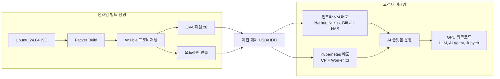
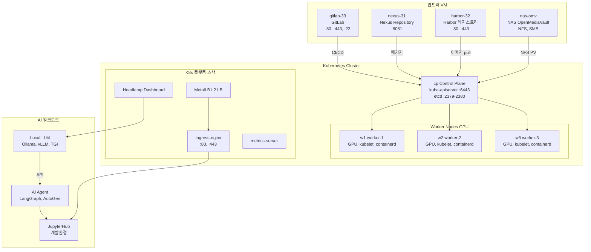
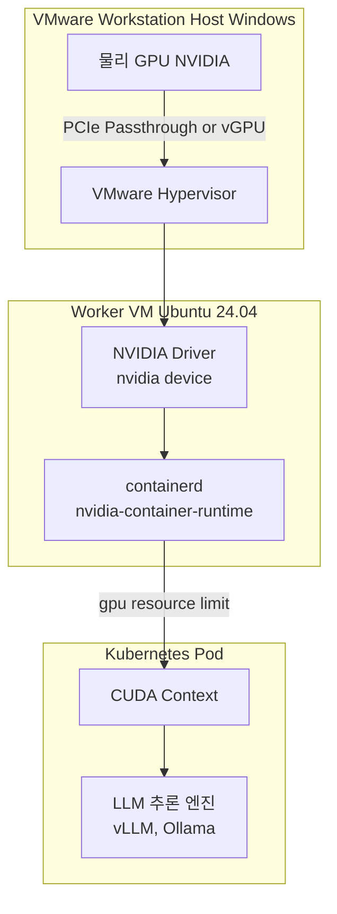
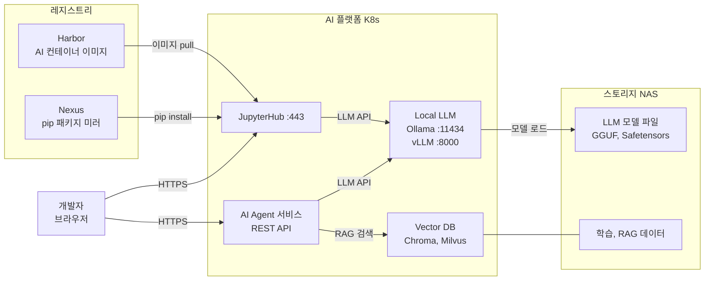
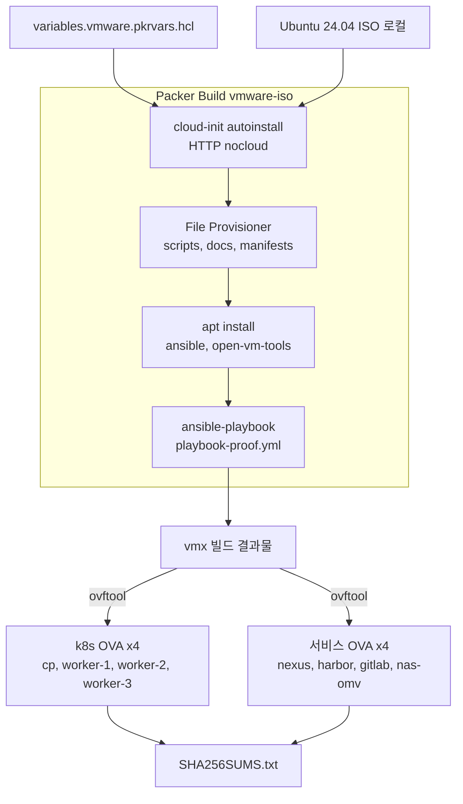
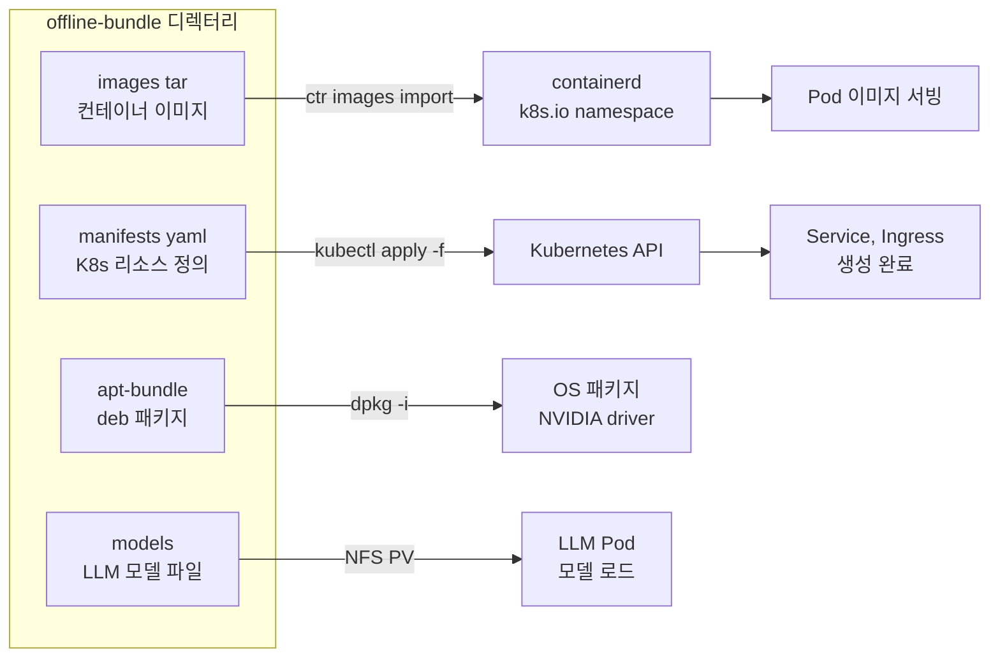

# k8s-jupyter — Air-gap AI Agent Platform (VMware OVA)

고객사 **폐쇄망(air-gap)** 환경에 VMware OVA로 VM을 포팅하여,  
**GPU 기반 Local LLM + AI Agent 개발·운영 플랫폼**을 구축하는 자동화 레포입니다.

---

## 기술 스택

### 플랫폼/인프라

- `VMware OVA`
- `Ubuntu 24.04`
- `Kubernetes`
- `containerd`
- `NVIDIA GPU / CUDA`
- `Harbor`, `Nexus`, `GitLab`, `NAS(OpenMediaVault)`

### AI/개발 스택

- `Ollama`, `vLLM`, `TGI`
- `JupyterHub`
- `LangGraph`, `AutoGen`
- `Chroma`, `Milvus`

### 로컬 개발 도구 체인

- `Visual Studio Code`
- `Ollama` 기반 로컬 LLM 추론
- `Codex CLI` + `Ollama (--oss)` 조합의 로컬 코딩 에이전트
- `Claude Code` + `Ollama` 조합의 로컬 코딩 에이전트
- `Node.js / npm`, `Git for Windows`
- 선택 사항: `VSCode Extension` 형태의 커스텀 로컬 에이전트 사이드바

### 오프라인(air-gap) 개발 원칙

- 인터넷이 없어도 `Ollama`에 미리 다운로드한 모델로 코드 작성, 리팩터링, 설명, 테스트 초안 생성 가능
- `Codex CLI`와 `Claude Code`는 로컬 작업 디렉터리 기준으로 파일 읽기/수정/명령 실행 워크플로우 구성 가능
- 웹 검색, 최신 문서 조회, 패키지 신규 설치, 원격 Git 연동은 인터넷 또는 사내 미러가 없으면 제한됨
- 폐쇄망 반입 전 `모델`, `pip/npm/apt 의존성`, `문서`, `예제 코드`를 사전 번들링하는 것을 권장
- 대형 코드베이스용 에이전트 작업은 큰 컨텍스트가 유리하므로 `Ollama` 컨텍스트 길이 상향 구성을 권장

### Windows 로컬 개발 보조 스크립트

- [setup-windows-ollama-dev.ps1](/home/ubuntu/k8s-jupyter/setup-windows-ollama-dev.ps1)
- 목적: `Windows + VSCode + Ollama + 로컬 GPU` 환경에서 `Codex CLI`, `Claude Code`, 로컬 모델 pull, VSCode 연동 점검 자동화

### VS Code 로컬 에이전트 확장

- [tools/vscode-local-agent/README.md](/home/ubuntu/k8s-jupyter/tools/vscode-local-agent/README.md)
- 목적: VS Code 왼쪽 `Activity Bar`에 `Local Agent` 아이콘을 추가하고, WSL에서 Windows Ollama(`http://172.29.32.1:11434`)를 호출하는 사이드바 채팅 패널 제공
- 실행: 루트 워크스페이스에서 `F5` 또는 `Run and Debug > Run Local Ollama Agent Extension`

---

## 아키텍처 다이어그램

### 1. 전체 딜리버리 파이프라인



---

### 2. 고객사 폐쇄망 VM 구성 (8대)



---

### 3. GPU Passthrough 구조



---

### 4. AI Agent 개발 워크플로우



---

### 5. OVA 빌드 상세 (Packer)



---

### 6. 오프라인 번들 반입 흐름



---

## VM 인벤토리

| VM | 역할 | 주요 서비스 | 포트 |
| ---- | ------ | ---------- | ------ |
| `cp` | Kubernetes Control Plane | kube-apiserver, etcd, scheduler | 6443, 2379-2380 |
| `w1` | Kubernetes Worker + GPU | kubelet, containerd, NVIDIA runtime | 10250 |
| `w2` | Kubernetes Worker + GPU | kubelet, containerd, NVIDIA runtime | 10250 |
| `w3` | Kubernetes Worker + GPU | kubelet, containerd, NVIDIA runtime | 10250 |
| `nexus-31` | Nexus Repository | apt mirror, pip mirror, helm chart | 8081 |
| `harbor-32` | Harbor Registry | 컨테이너 이미지 레지스트리 | 80, 443 |
| `nas-omv` | NAS (OpenMediaVault) | NFS, SMB 공유 스토리지 | 2049(NFS) |
| `gitlab-33` | GitLab | 소스코드 관리, CI/CD | 80, 443, 22 |

---

## 핵심 디렉터리

```text
.
├── packer/         # VM/OVA 이미지 빌드 정의 (vmware-iso)
├── scripts/        # VM 네트워크·설치·반입·검증 자동화
└── docs/           # 단계별 운영 문서
```

---

## 빠른 시작

```bash
# Phase 1: OVA 빌드 (온라인 환경)
bash scripts/phase1_build_ova_assets.sh all

# Phase 2: OVA 기동 후 air-gap 운영 준비
bash scripts/phase2_operate_airgap_cluster.sh all

# Phase 3: 폐쇄망 설치
bash scripts/phase3_install_from_completed_ova.sh full

# 상태 확인
bash scripts/status_k8s.sh
bash scripts/check_vm_airgap_status.sh
```

---

## 설치 절차 (OVA 기준)

### 1. 준비물

- OVA 파일 8개 (cp, w1~3, nexus, harbor, gitlab, nas-omv)
- 오프라인 번들 (`images/*.tar`, `manifests/`, `apt-bundle/`, `models/`)

### 2. VM 기본 설정 (각 노드)

```bash
sudo bash scripts/set_static_ip.sh --ip <IP> --prefix 24 --gateway <GW>
sudo bash scripts/set_hostname_hosts.sh --hostname <HOSTNAME> --entry "<IP> <HOSTNAME>"
```

### 3. 오프라인 번들 반입

```bash
bash scripts/import_offline_bundle.sh --bundle-dir /opt/k8s-data-platform/offline-bundle --apply
```

### 4. 설치 후 점검

```bash
bash scripts/status_k8s.sh
bash scripts/check_vm_airgap_status.sh
kubectl get nodes -o wide
kubectl get pods -A
```

### 5. OVA 재생성 (필요 시)

```bash
bash ovabuild.sh --vars-file packer/variables.vmware.auto.pkrvars.hcl --dist-dir C:/ffmpeg
```

---

## 장애 대응

### Kubernetes 기본 상태

```bash
bash scripts/status_k8s.sh
kubectl get nodes -o wide && kubectl get pods -A
```

### containerd / kubelet 비정상

```bash
sudo systemctl restart containerd kubelet
sudo systemctl status containerd kubelet --no-pager
```

### 오프라인 이미지 반입 실패

```bash
bash scripts/import_offline_bundle.sh --bundle-dir /opt/k8s-data-platform/offline-bundle --runtime-only
```

### VM 네트워크 문제

```bash
ip a && ip route && cat /etc/hosts
sudo bash scripts/set_static_ip.sh --ip <IP> --prefix 24 --gateway <GW>
```

---

## 문서 맵

| 문서 | 내용 |
| ------ | ------ |
| `docs/phase-1-build-ova.md` | OVA 빌드 (온라인) |
| `docs/phase-2-ova-solution-ops.md` | OVA 기동 후 운영 준비 |
| `docs/phase-3-install-airgap-from-ova.md` | 폐쇄망 설치 |
| `CHECKLIST.md` | 빌드·배포·리허설 체크리스트 |
| `PORTS.md` | 포트 목록 |
| `CHANGELOG.md` | 변경 이력 |
