# k8s-data-platform-ova

🌐 [English](README.en.md) | [中文](README.zh.md) | [日本語](README.ja.md) | **한국어**

이 저장소는 `Ubuntu 24 OVA -> kubeadm single-node Kubernetes -> platform workloads` 구조를 기준으로 만든 실습/운영용 플랫폼입니다. 현재 실행 기준은 Docker Compose 가 아니라 `Kubernetes manifest + kustomize overlay + kubeadm/bootstrap` 이며, OVA 안에 Docker Engine, containerd, kubeadm, kubelet, kubectl, vim, curl, Node.js, Python, 이미지 캐시, 오프라인 번들까지 미리 넣는 방향으로 정리했습니다.

추가로, 이 README는 기존 Kubernetes 중심 설명 위에 다음 운영 관점을 더 잘 보이도록 보강했습니다.

- OVA import 후 VirtualBox / VMware 에서 바로 테스트 가능한 흐름
- 폐쇄망 환경에서의 서비스 접근 방식
- Frontend 개발 환경(`code-server`, `Vite`, `npm offline`) 사용 절차
- 오프라인 번들 import / 검증 체크리스트

핵심 요구 반영 사항은 아래와 같습니다.

- 사용자별 JupyterLab 세션을 Kubernetes Pod/Service 로 생성
- 사용자별 workspace 를 `PVC subPath` 로 지속화
- workspace 를 Kaniko Job 으로 Harbor snapshot 이미지화
- 다음 로그인 시 Harbor snapshot 이미지를 우선 선택해 재기동
- 플랫폼 공통 이미지는 `docker.io/edumgt/*` 에서 pull
- OVA 내부에 Docker Engine, 기본 유틸리티, 플랫폼 이미지, 오프라인 라이브러리 번들 선탑재

## Kubernetes 구조 확인

현재 구조는 Kubernetes 가 맞습니다.

- 호스트 런타임: `Ubuntu 24`
- 클러스터: `kubeadm` 기반 single-node Kubernetes
- 배포 기준: `infra/k8s/base` + `infra/k8s/overlays/dev|prod`
- 워크로드: `backend`, `frontend`, `mongodb`, `redis`, `airflow(optional)`, `jupyter`, `gitlab`, `gitlab-runner`, `nexus`
- 사용자 Jupyter 세션: backend 가 Kubernetes API 로 per-user Pod/Service 생성

즉, 이 저장소는 이미 Kubernetes 중심 구조였고, 이번 변경은 그 위에 `PVC subPath + snapshot publish/restore + registry/offline` 레이어를 보강한 것입니다.

## 구조 요약

```text
.
├── apps/
│   ├── airflow/          # Airflow image + DAG
│   ├── backend/          # FastAPI API + k8s session/snapshot control
│   ├── frontend/         # Quasar(Vue 3) dashboard
│   └── jupyter/          # JupyterLab image + bootstrap workspace
├── ansible/              # OVA guest provisioning, Docker/Kubernetes/bootstrap
├── infra/
│   ├── harbor/           # Harbor snapshot integration notes
│   └── k8s/              # base manifests + dev/prod overlays + runner overlay
├── packer/               # Ubuntu 24 OVA template
└── scripts/              # build/publish/apply/offline helper scripts
```

## 아키텍처 Flowchart

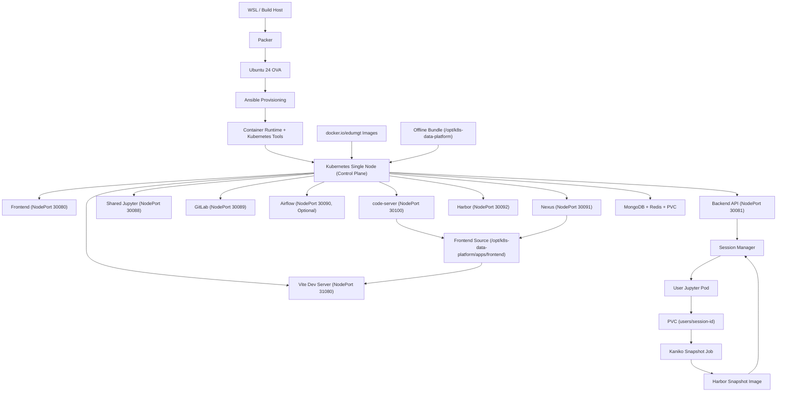

## Jupyter Snapshot Sequence

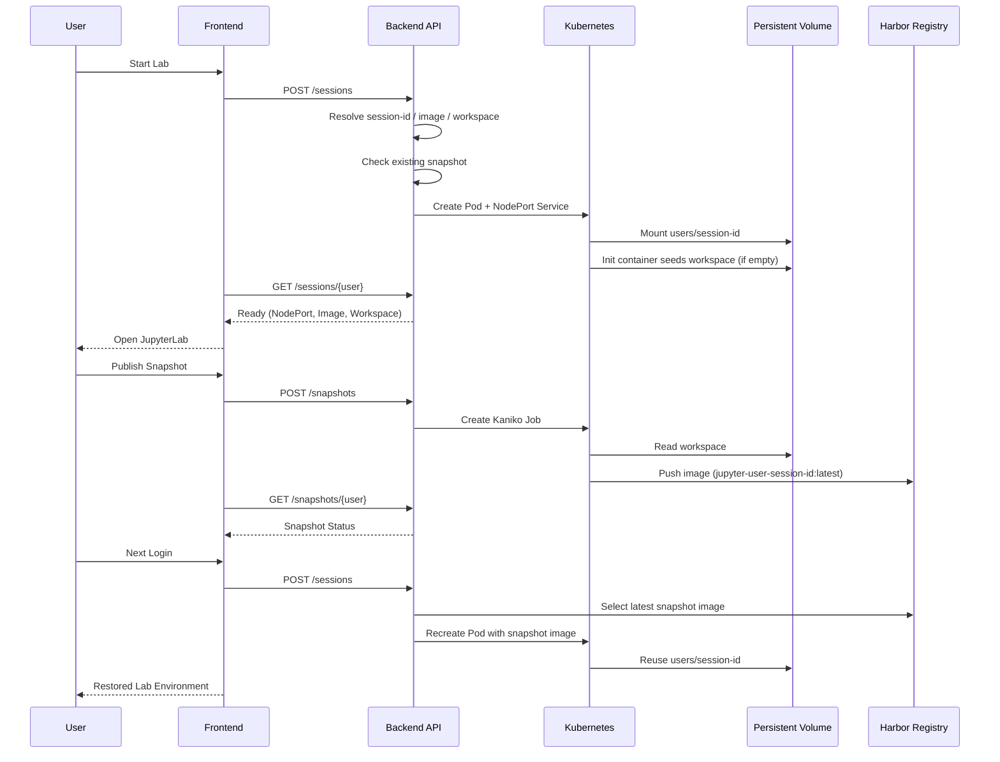

## 사용자별 세션 규칙

공통 식별자 규칙은 [apps/backend/app/services/lab_identity.py](/c:/devtest/Kubernetes-Jupyter-Sandbox/apps/backend/app/services/lab_identity.py) 에 모았습니다.

- `username` 정규화
- `session_id` 생성
- `pod_name`
- `service_name`
- `workspace_subpath`
- Harbor snapshot image 경로

이 규칙을 바탕으로:

- [apps/backend/app/services/jupyter_sessions.py](/c:/devtest/Kubernetes-Jupyter-Sandbox/apps/backend/app/services/jupyter_sessions.py)
  가 Pod/Service/PVC mount 를 관리하고,
- [apps/backend/app/services/jupyter_snapshots.py](/c:/devtest/Kubernetes-Jupyter-Sandbox/apps/backend/app/services/jupyter_snapshots.py)
  가 Kaniko snapshot publish/status/restore image 선택을 담당합니다.

## 이미지 전략

플랫폼 기본 이미지와 서드파티 런타임 이미지는 모두 `docker.io/edumgt/*` 기준으로 맞췄습니다.

- platform app images
  - `docker.io/edumgt/k8s-data-platform-backend:latest`
  - `docker.io/edumgt/k8s-data-platform-frontend:latest`
  - `docker.io/edumgt/k8s-data-platform-airflow:latest`
  - `docker.io/edumgt/k8s-data-platform-jupyter:latest`
- mirrored runtime/base images
  - `docker.io/edumgt/platform-python:*`
  - `docker.io/edumgt/platform-node:*`
  - `docker.io/edumgt/platform-nginx:*`
  - `docker.io/edumgt/platform-mongodb:*`
  - `docker.io/edumgt/platform-redis:*`
  - `docker.io/edumgt/platform-gitlab-ce:*`
  - `docker.io/edumgt/platform-gitlab-runner:*`
  - `docker.io/edumgt/platform-kaniko-executor:*`

Harbor 는 플랫폼 공통 이미지 레지스트리가 아니라 `per-user Jupyter snapshot registry` 로만 사용합니다. Docker Hub `edumgt/*` 로 push 한 app/runtime 이미지를 Harbor 에 1:1 동기화하는 구조는 현재 포함되어 있지 않고, 대신 폐쇄망 패키지 저장소는 Nexus 를 추가했습니다.

## 빠른 시작

### 1. OVA 변수 준비

```bash
cp packer/variables.pkr.hcl.example packer/variables.pkr.hcl
```

### 2. OVA 빌드

```bash
bash scripts/run_wsl.sh --skip-export
```

OVA export 까지 한 번에 진행하려면:

```bash
bash scripts/run_wsl.sh
```

### 2-1. Packer 실행 환경 정리 (WSL 기준)

- `scripts/run_wsl.sh`, `scripts/build_packer_artifacts.sh` 는 WSL에서 실행하도록 작성되어 있습니다.
- `packer`는 WSL native 설치본 또는 `packer.exe`(Windows 설치본) 둘 다 사용 가능합니다.
- OVA export는 Windows VirtualBox(`VBoxManage.exe`) 또는 OVF Tool을 WSL에서 호출하는 구조입니다.

### 2-2. OVA/ISO/qcow2/AMI용 파일을 `C:\tmp`에 일괄 생성 (기존 파일 덮어쓰기)

```bash
bash scripts/build_packer_artifacts.sh --output-win-dir 'C:\tmp'
```

기본 산출물:

- `C:\tmp\k8s-data-platform.ova`
- `C:\tmp\k8s-data-platform.iso`
- `C:\tmp\k8s-data-platform.qcow2`
- `C:\tmp\k8s-data-platform-ami.raw`
- `C:\tmp\k8s-data-platform-ami-import.json`
- `C:\tmp\k8s-data-platform-artifacts.sha256`

참고:

- 동일 파일이 이미 있으면 스크립트에서 자동으로 삭제 후 새로 생성합니다.
- `qemu-img`가 필요하므로 WSL에서 `qemu-utils` 설치가 선행되어야 합니다.

```bash
sudo apt-get update
sudo apt-get install -y qemu-utils
```

이미 packer build를 끝낸 상태에서 변환/내보내기만 다시 할 때:

```bash
bash scripts/build_packer_artifacts.sh --skip-packer-build --output-win-dir 'C:\tmp'
```

AWS AMI 등록은 생성된 `*-ami.raw`, `*-ami-import.json` 파일을 사용해 VM Import로 진행합니다.

### 3. Docker Hub mirror + local Kubernetes runtime import

로컬 Docker login 상태를 사용해서 `edumgt` 네임스페이스 기준으로 support/app 이미지를 정리합니다.

```bash
bash scripts/build_k8s_images.sh --namespace edumgt --tag latest
```

Docker Hub push 까지 하려면:

```bash
docker login
bash scripts/publish_dockerhub.sh --namespace edumgt --tag latest
```

### 4. Kubernetes 적용

```bash
bash scripts/apply_k8s.sh --env dev
```

초기화 후 재적용:

```bash
bash scripts/reset_k8s.sh --env dev
bash scripts/apply_k8s.sh --env dev
```

상태 확인:

```bash
bash scripts/status_k8s.sh --env dev
```

### 5. GitLab Runner overlay

```bash
bash scripts/apply_k8s.sh --env dev --with-runner
kubectl scale deployment/gitlab-runner -n data-platform-dev --replicas=1
```

### 5-1. BE/FE Minor Version Bump

BE, FE 소스에 작은 변경이 있을 때 버전을 `0.1` 단위(semver minor)로 함께 올리려면:

```bash
bash scripts/bump_be_fe_minor_version.sh
```

예시:
- `backend 0.2.0 -> 0.3.0`
- `frontend 0.2.0 -> 0.3.0`

### 6. Nexus Offline Repository

PyPI 와 npm 의 폐쇄망 캐시는 Nexus 로 관리하도록 보강했습니다.

```bash
bash scripts/apply_k8s.sh --env dev
bash scripts/setup_nexus_offline.sh --namespace data-platform-dev --nexus-url http://127.0.0.1:30091
```

이미 초기화된 Nexus(admin 비밀번호 변경 상태)에서 재실행할 때:

```bash
bash scripts/setup_nexus_offline.sh \
  --namespace data-platform-dev \
  --nexus-url http://127.0.0.1:30091 \
  --current-password '<current-admin-password>' \
  --target-password '<new-admin-password>' \
  --username admin \
  --password '<new-admin-password>'
```

의존성 접근 검증:

```bash
bash scripts/verify_nexus_dependencies.sh \
  --nexus-url http://127.0.0.1:30091 \
  --username admin \
  --password '<nexus-password>'
```

코드 기준으로 Docker Hub 와 Harbor 사용 범위를 다시 확인하려면:

```bash
bash scripts/audit_registry_scope.sh
```

## OVA Import 후 테스트

이 저장소는 빌드뿐 아니라 **OVA 를 VirtualBox 또는 VMware 에 import 한 뒤 바로 실행/검증하는 사용 시나리오**를 전제로 합니다.

VMware 전용 실행 절차는 별도 문서를 참고하세요:
- [docs/vmware/README.md](docs/vmware/README.md)

### VirtualBox VM Export (Source Host)

기존 VM 3대를 OVA 로 내보낼 때 사용할 PowerShell 명령:

```powershell
& "C:\Program Files\Oracle\VirtualBox\VBoxManage.exe" controlvm k8s-data-platform poweroff
& "C:\Program Files\Oracle\VirtualBox\VBoxManage.exe" controlvm k8s-worker-1 poweroff
& "C:\Program Files\Oracle\VirtualBox\VBoxManage.exe" controlvm k8s-worker-2 poweroff

& "C:\Program Files\Oracle\VirtualBox\VBoxManage.exe" export k8s-data-platform --output C:\tmp\k8s-data-platform.ova
& "C:\Program Files\Oracle\VirtualBox\VBoxManage.exe" export k8s-worker-1 --output C:\tmp\k8s-worker-1.ova
& "C:\Program Files\Oracle\VirtualBox\VBoxManage.exe" export k8s-worker-2 --output C:\tmp\k8s-worker-2.ova
```

### 권장 VM 사양

- CPU 4 core 이상
- Memory 16GB 이상
- Disk 100GB 이상
- NIC 는 `Bridged Adapter` 권장

### VirtualBox import 절차

1. VirtualBox 에서 `파일 > 가상 시스템 가져오기`
2. 생성된 OVA 파일 선택
3. CPU / Memory / Disk 설정 확인
4. 네트워크를 `Bridged Adapter` 또는 사내 테스트망에 맞게 설정
5. VM 부팅 후 IP 확인

IP 확인 예시:

```bash
hostname -I
```

또는:

```bash
ip addr
```

### 부팅 후 기본 확인

```bash
kubectl get nodes
kubectl get pods -A
kubectl get svc -A
```

확인 포인트:

- node 상태가 `Ready`
- 핵심 pod 가 `Running`
- 서비스가 `NodePort` 로 노출됨

### 웹 접속 확인

- Frontend: `http://<OVA_IP>:30080`
- Backend: `http://<OVA_IP>:30081`
- Jupyter: `http://<OVA_IP>:30088`
- GitLab: `http://<OVA_IP>:30089`
- Nexus: `http://<OVA_IP>:30091`
- Harbor: `http://<OVA_IP>:30092`
- code-server: `http://<OVA_IP>:30100`
- Frontend Dev: `http://<OVA_IP>:31080`

## Frontend / API

- Frontend 로그인 계정
  - user: `test1@test.com / 123456`
  - user: `test2@test.com / 123456`
  - admin: `admin@test.com / 123456`
- 로그인은 JWT 기반 modal UI로 먼저 수행
- 일반 사용자는 로그인 후 본인 전용 Jupyter sandbox 만 시작/중지/복원
- 일반 사용자는 본인 Jupyter 사용 이력(로그인/실행 횟수, 현재/누적 사용시간)을 확인
- 관리자는 AG Grid CE 기반 사용자 목록으로 sandbox 상태/사용 지표를 모니터링
- Backend API:
  - `POST /api/auth/login`
  - `GET /api/auth/me`
  - `POST /api/auth/logout`
  - `GET /api/users/me/usage`
  - `POST /api/jupyter/sessions`
  - `GET /api/jupyter/sessions/{username}`
  - `DELETE /api/jupyter/sessions/{username}`
  - `GET /api/jupyter/snapshots/{username}`
  - `POST /api/jupyter/snapshots`
  - `GET /api/admin/sandboxes`

Frontend 는 로그인 모드에 따라 사용자용(Jupyter 작업 + 내 사용 이력) 또는 관리자용(AG Grid CE 사용자 목록 + control-plane) 화면으로 분기됩니다.

Airflow 는 현재 `platform_health_check` DAG 기반의 샘플 오케스트레이션 역할이며, Jupyter sandbox / GitLab / offline bundle 핵심 경로에는 필수는 아닙니다. 폐쇄망 최소 실행용으로는 backend 와 frontend 를 하나의 pod 로 묶은 offline suite 도 추가했습니다.

## Frontend 개발 환경

이 OVA 는 운영 Frontend 뿐 아니라 **폐쇄망 내 Vue 개발 환경**도 함께 제공합니다.

구성은 다음과 같습니다.

- 운영 Frontend: Kubernetes NodePort `30080`
- 개발 Frontend: Vite dev server `31080`
- IDE: `code-server` `30100`
- 패키지 공급: Nexus npm registry + offline npm cache

### code-server 접속

```text
http://<OVA_IP>:30100
```

로그인 후 다음 경로를 엽니다.

```text
/opt/k8s-data-platform/apps/frontend
```

### 의존성 설치

```bash
bash /opt/k8s-data-platform/scripts/frontend_dev_setup.sh
```

인증이 필요한 Nexus 인 경우:

```bash
bash /opt/k8s-data-platform/scripts/frontend_dev_setup.sh \
  --registry http://127.0.0.1:30091/repository/npm-all/ \
  --username admin \
  --password '<nexus-password>'
```

동작 우선순위:

1. Nexus npm registry 사용
2. 실패 시 offline npm cache 사용

수동 설정 예시:

```bash
npm config set registry http://127.0.0.1:30091/repository/npm-group/
```

### 개발 서버 실행

```bash
bash /opt/k8s-data-platform/scripts/run_frontend_dev.sh
```

브라우저 접속:

```text
http://<OVA_IP>:31080
```

### Backend API 연동 예시

```bash
VITE_API_BASE_URL=http://127.0.0.1:30081
```

### Frontend 협업 예시

```bash
git clone http://127.0.0.1:30089/dev2/platform-frontend.git
cd platform-frontend
git add .
git commit -m "update"
git push origin main
```

### Demo Screenshots

JWT modal 로그인 화면:

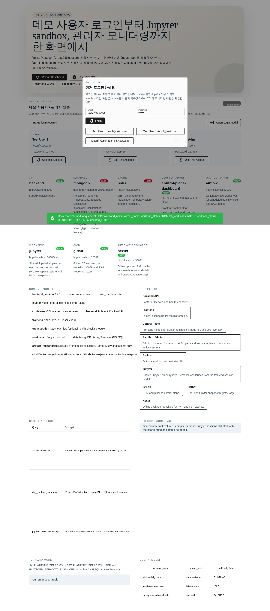

`test1@test.com` 사용자의 본인 계정 Jupyter 사용 이력 카드:

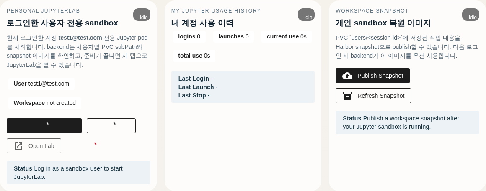

`admin@test.com` 관리자의 AG Grid CE 사용자 목록:

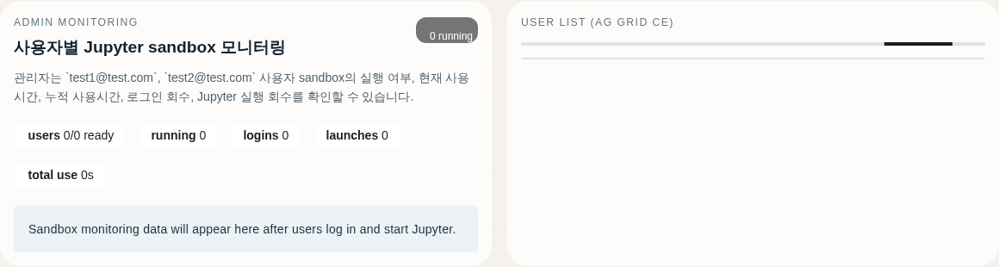

`test1@test.com` 사용자가 본인 sandbox JupyterLab에 접속해 `print("hello world")` 결과를 확인하는 화면:


`admin@test.com` 관리자가 관리자 모드로 접속해 현재 실행 중인 사용자 수를 보는 monitoring 대시보드:


### GitLab Public Repo Demo

실행 중인 GitLab pod 에 demo 계정과 공개 repo 를 만들어 `apps/backend`, `apps/frontend` 를 app repo 로 분리해 push/pull 하는 흐름도 재현했습니다.

- GitLab demo user: `dev1@dev.com / 123456`
- GitLab demo user: `dev2@dev.com / 123456`
- public repo: `dev1/platform-backend`
- public repo: `dev2/platform-frontend`

`dev1` 이 backend public repo 를 소유하고 있는 GitLab 화면:

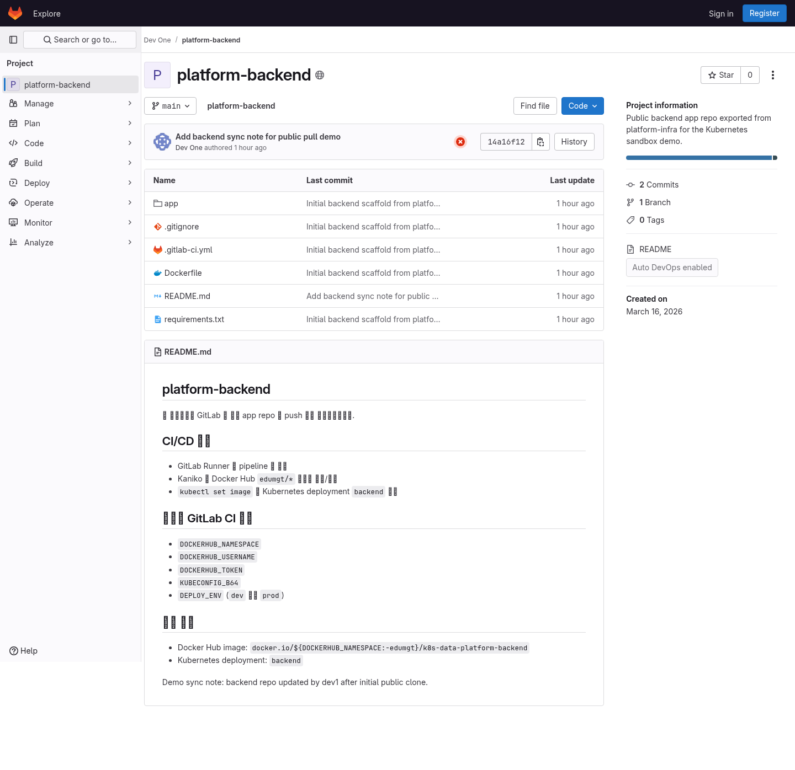

`dev2` 가 frontend public repo 를 소유하고 있는 GitLab 화면:

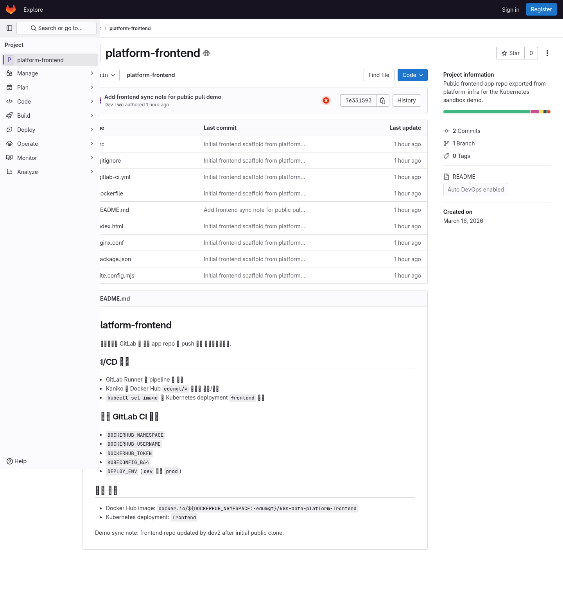

backend repo 를 `dev1` 이 push 하고, `dev2` clone 후 update 를 `git pull` 로 가져오는 흐름:

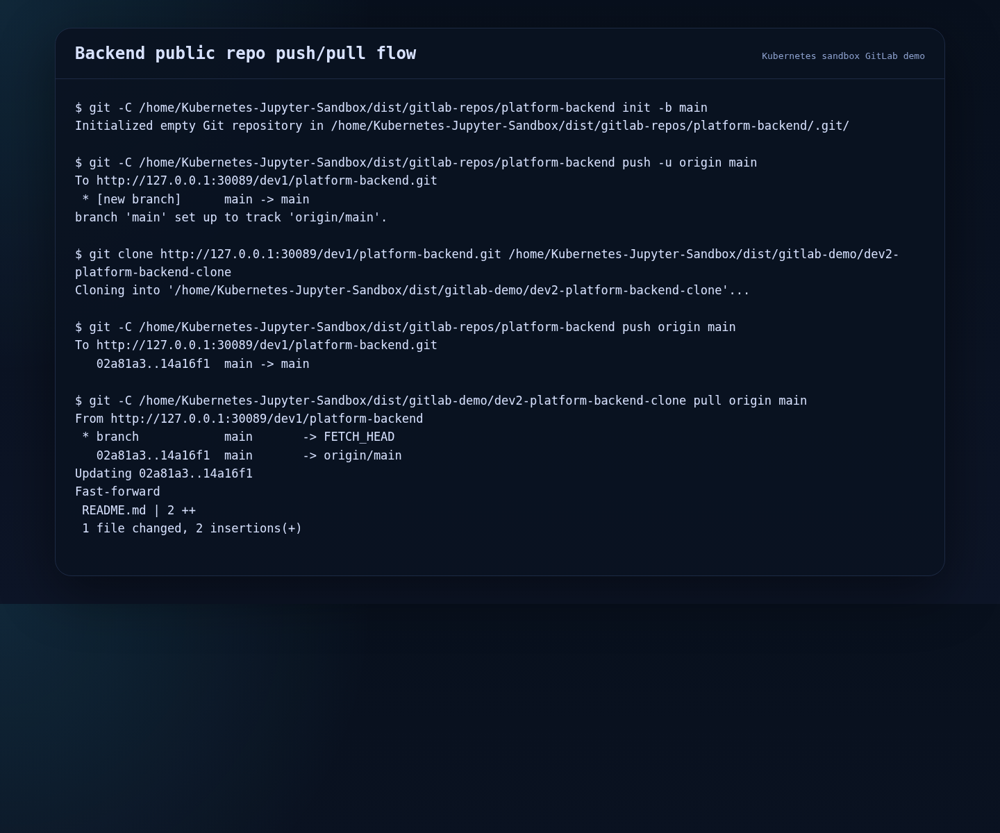

frontend repo 를 `dev2` 가 push 하고, `dev1` clone 후 update 를 `git pull` 로 가져오는 흐름:


재현 명령:

```bash
bash scripts/demo_gitlab_repo_flow.sh
source dist/gitlab-demo/gitlab-demo.env
CAPTURE_TARGETS=gitlab-backend-repo,gitlab-frontend-repo,backend-git-flow,frontend-git-flow \
  PLAYWRIGHT_IMAGE=local/playwright-runner:latest \
  bash scripts/capture_k8s_screenshots.sh
```

## 폐쇄망 / OVA 준비

OVA provisioning 시 아래 항목을 미리 넣도록 구성했습니다.

- Docker Engine
- containerd
- kubeadm
- kubelet
- kubectl
- Python 3.12 tooling
- Node.js 22
- vim, curl, git, jq, rsync, zip, unzip, wget
- `/opt/k8s-data-platform/scripts`
- `/opt/k8s-data-platform/docs`
- `/opt/k8s-data-platform/apps/frontend`
- `code-server`
- platform/app images preload
- `/opt/k8s-data-platform/offline-bundle`

오프라인 번들을 수동으로 다시 만들려면:

```bash
bash scripts/prepare_offline_bundle.sh --out-dir dist/offline-bundle
```

번들 내용:

- `images/`: Docker load / Kubernetes container runtime import 용 tar archives
- `wheels/`: backend/jupyter/airflow Python wheel cache
- `npm-cache/`: frontend npm cache
- `frontend-package-lock.json`: frontend offline rebuild 기준 lockfile
- `k8s/`: offline apply/import 용 manifests, helper scripts, 운영 문서

폐쇄망 최소 stack(one-pod backend/frontend + Nexus cache) 을 적용하려면:

```bash
bash scripts/apply_offline_suite.sh
```

오프라인 번들로 이미지 import 와 k8s 적용까지 진행하려면:

```bash
bash scripts/import_offline_bundle.sh --bundle-dir dist/offline-bundle --apply --env dev
```

## 외부망 초기 구성 / 폐쇄망 전환 다이어그램

아래 다이어그램은 다음 2가지 운영 구간을 분리해 설명합니다.

- `A`: 외부망에서 최초 OVA/이미지/번들을 준비하는 구간
- `B`: OVA 복제 후 폐쇄망에서 서비스 기동/업데이트를 수행하는 구간

### A) 외부망 최초 구성 (Seed Build) 아키텍처

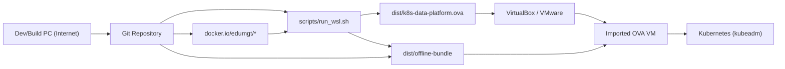

### A-1) 외부망 최초 구성 순서도

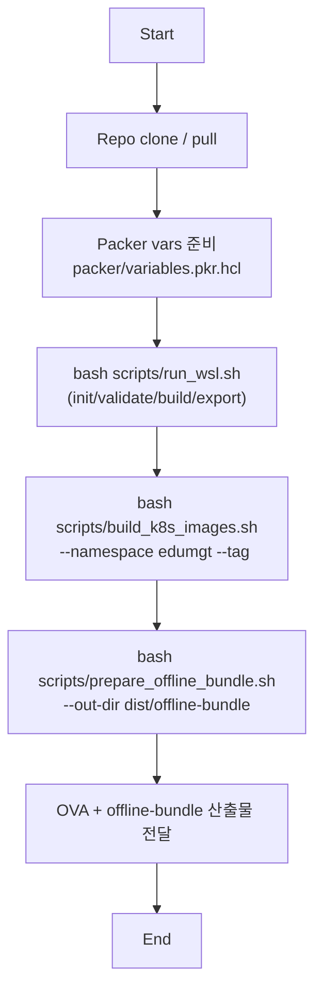

### A-2) 외부망 최초 구성 시퀀스

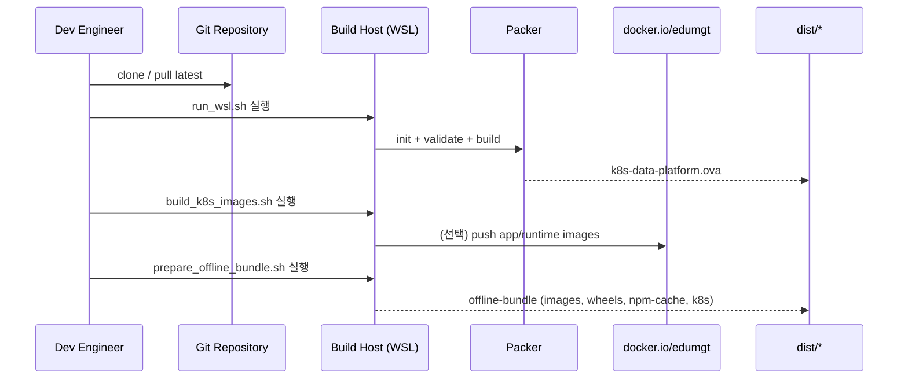

### B) OVA 복제 후 폐쇄망 구성 아키텍처

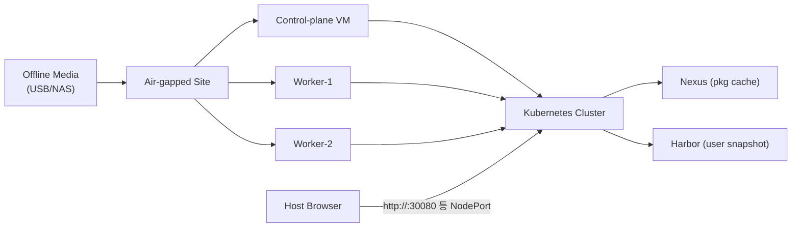

### B-1) 폐쇄망 운영 순서도

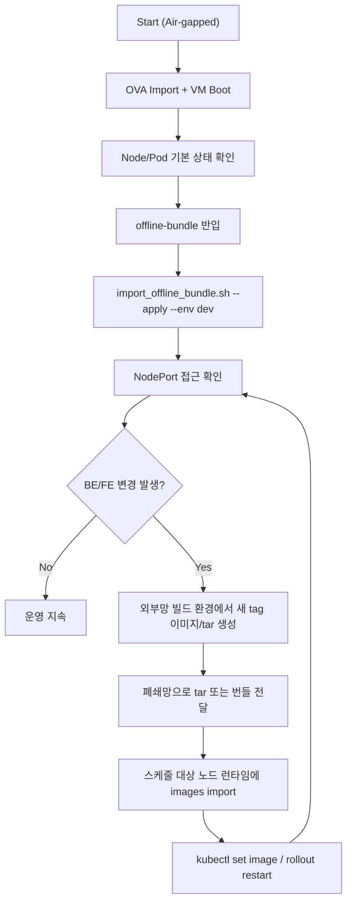

### B-2) 폐쇄망 BE/FE 변경 반영 시퀀스

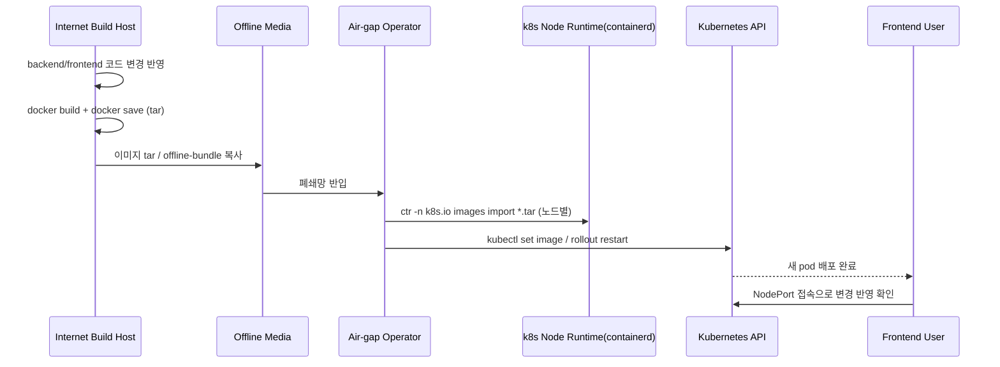

### 폐쇄망 BE/FE 변경 운영 규칙

- `docker.io` pull/push가 막혀 있으면, 이미지는 `tar` 반입 + `ctr images import`로 배포합니다.
- `frontend`가 여러 worker에 스케줄되면, 해당 worker 모두에 같은 태그 이미지를 import 해야 합니다.
- `imagePullPolicy: IfNotPresent` 전략을 유지하면 로컬 런타임 캐시 이미지를 우선 사용합니다.
- `latest` 고정보다 버전 태그(`2026.03.19-1` 등) 사용이 롤백/추적에 유리합니다.

예시(외부망 빌드 환경):

```bash
IMAGE_TAG=2026.03.19-1
bash scripts/build_k8s_images.sh --namespace edumgt --tag "${IMAGE_TAG}" --skip-runtime-import
bash scripts/prepare_offline_bundle.sh --out-dir dist/offline-bundle --namespace edumgt --tag "${IMAGE_TAG}"
```

예시(폐쇄망 적용 환경):

```bash
bash /opt/k8s-data-platform/scripts/import_offline_bundle.sh \
  --bundle-dir /opt/k8s-data-platform/offline-bundle \
  --apply --env dev
```

BE/FE만 수동 롤링 갱신할 때:

```bash
sudo ctr -n k8s.io images import backend.tar
sudo ctr -n k8s.io images import frontend.tar

sudo KUBECONFIG=/etc/kubernetes/admin.conf kubectl -n data-platform-dev \
  set image deploy/backend backend=docker.io/edumgt/k8s-data-platform-backend:2026.03.19-1

sudo KUBECONFIG=/etc/kubernetes/admin.conf kubectl -n data-platform-dev \
  set image deploy/frontend frontend=docker.io/edumgt/k8s-data-platform-frontend:2026.03.19-1
```

## 오프라인 사용 전략

폐쇄망 환경에서는 다음 순서로 동작하는 것을 기본값으로 봅니다.

1. OVA 내부 preload 이미지와 도구로 기본 클러스터 기동
2. `offline-bundle` 을 이용해 필요한 이미지/패키지 import
3. Nexus 로 Python / npm 패키지 캐시 제공
4. Harbor 는 사용자 snapshot 저장소로 활용
5. 모든 외부 노출은 `NodePort` 로 접근

즉, 인터넷 연결 없이도 다음이 가능해야 합니다.

- 플랫폼 서비스 기동
- 사용자별 Jupyter 세션 생성/복원
- GitLab 저장소 clone/push
- Frontend 의존성 설치 및 Vite 실행
- Harbor snapshot publish/restore

## GitHub Actions

변경된 컨테이너 자산을 Docker Hub 로 보내는 workflow 를 추가했습니다.

- workflow: [.github/workflows/publish-images.yml](/c:/devtest/Kubernetes-Jupyter-Sandbox/.github/workflows/publish-images.yml)
- required secrets:
  - `DOCKERHUB_USERNAME`
  - `DOCKERHUB_TOKEN`

검증 workflow 는 새 스크립트까지 shell syntax 검사를 수행합니다.

## Git Hooks

대용량 산출물과 오프라인 번들이 다시 커밋에 섞이지 않도록 repo 전용 `pre-commit` 훅을 추가했습니다.

한 번만 설치하면 됩니다.

```bash
bash scripts/install_git_hooks.sh
```

이 훅은 아래 항목을 커밋 단계에서 차단합니다.

- `.tmp-k8s-images/*`
- `dist/offline-bundle/*`
- `packer/output-*/*`
- `*.tar`, `*.tar.gz`, `*.tgz`, `*.zip`, `*.whl`
- `*.ova`, `*.qcow2`, `*.vmdk`, `*.vdi`
- 50 MiB 이상으로 stage 된 파일

## 주요 NodePort

- Frontend: `30080`
- Backend API: `30081`
- JupyterLab: `30088`
- GitLab Web: `30089`
- Airflow: `30090`
- Nexus: `30091`
- Harbor: `30092`
- code-server: `30100`
- Frontend Dev (Vite): `31080`
- GitLab SSH: `30224`

## 테스트 체크리스트

OVA import 후 아래 항목을 순서대로 확인하면 기본 검증이 가능합니다.

- VM 부팅 완료
- `kubectl get nodes` 결과가 `Ready`
- `kubectl get pods -A` 결과에서 핵심 Pod 가 `Running`
- Frontend / Backend / GitLab / Nexus / Harbor / code-server 접속 가능
- `frontend_dev_setup.sh` 실행 가능
- `run_frontend_dev.sh` 실행 후 `31080` 접속 가능
- GitLab clone / commit / push 가능
- Harbor push/pull 또는 snapshot publish 가능
- 인터넷 없이 재부팅 후 서비스 재확인 가능

## 주요 파일

- OVA template: [packer/k8s-data-platform.pkr.hcl](/c:/devtest/Kubernetes-Jupyter-Sandbox/packer/k8s-data-platform.pkr.hcl)
- Ansible playbook: [ansible/playbook.yml](/c:/devtest/Kubernetes-Jupyter-Sandbox/ansible/playbook.yml)
- Docker runtime role: [ansible/roles/container_runtime/tasks/main.yml](/c:/devtest/Kubernetes-Jupyter-Sandbox/ansible/roles/container_runtime/tasks/main.yml)
- Platform bootstrap: [ansible/roles/platform_bootstrap/tasks/main.yml](/c:/devtest/Kubernetes-Jupyter-Sandbox/ansible/roles/platform_bootstrap/tasks/main.yml)
- Base k8s manifests: [infra/k8s/base/kustomization.yaml](/c:/devtest/Kubernetes-Jupyter-Sandbox/infra/k8s/base/kustomization.yaml)
- Session controller: [apps/backend/app/services/jupyter_sessions.py](/c:/devtest/Kubernetes-Jupyter-Sandbox/apps/backend/app/services/jupyter_sessions.py)
- Snapshot controller: [apps/backend/app/services/jupyter_snapshots.py](/c:/devtest/Kubernetes-Jupyter-Sandbox/apps/backend/app/services/jupyter_snapshots.py)
- Frontend dashboard: [apps/frontend/src/App.vue](/c:/devtest/Kubernetes-Jupyter-Sandbox/apps/frontend/src/App.vue)
- Local build/publish: [scripts/build_k8s_images.sh](/c:/devtest/Kubernetes-Jupyter-Sandbox/scripts/build_k8s_images.sh)
- Offline bundle: [scripts/prepare_offline_bundle.sh](/c:/devtest/Kubernetes-Jupyter-Sandbox/scripts/prepare_offline_bundle.sh)
- Offline import/apply: [scripts/import_offline_bundle.sh](/c:/devtest/Kubernetes-Jupyter-Sandbox/scripts/import_offline_bundle.sh)

## 결론

이 저장소는 단순히 Kubernetes manifest 모음이 아니라, 다음을 하나의 OVA 안에 통합하려는 목적을 갖고 있습니다.

- Kubernetes 실행 환경
- DevOps 협업 도구
- Jupyter 기반 사용자 sandbox
- Frontend 개발 환경
- 오프라인 패키지 및 이미지 번들

즉, **폐쇄망 Kubernetes + DevOps + Frontend 개발 환경을 하나의 OVA 로 제공하는 실행형 플랫폼**이 이 저장소의 핵심 방향입니다.

## OVA 실기 검증 기록

아래는 실제로 이 저장소를 기준으로 OVA 검증을 진행하려고 확인한 항목과 현재 상태입니다.

검증 일시:

- `2026-03-18`

검증 목표:

- OVA 생성
- VirtualBox import
- VM 부팅
- 로그인 후 `kubectl` 실행
- 화면 캡처 확보

### 현재 확인된 상태

실제 환경에서 다음 항목을 확인했습니다.

- VirtualBox 설치 확인: `C:\Program Files\Oracle\VirtualBox\VBoxManage.exe`
- 기존 VirtualBox VM 목록: 없음
- 기존 `dist/` 산출물: 없음
- Windows `packer`: 미설치
- WSL `packer`: 미설치
- Packer 설정 ISO 경로: `C:\Users\HKIT\Downloads\ubuntu-24.04.4-live-server-amd64.iso`
- 해당 ISO 존재 여부: 없음

즉, **현재 이 실행 환경에서는 OVA 생성에 필요한 핵심 전제 2가지가 충족되지 않아 실제 import / 부팅 / 캡처 증빙까지 완료하지 못했습니다.**

- `packer` 미설치
- Ubuntu 24 ISO 미존재

### 실제 확인 명령

VirtualBox 설치 확인:

```powershell
Test-Path 'C:\Program Files\Oracle\VirtualBox\VBoxManage.exe'
```

결과:

```text
True
```

VirtualBox 등록 VM 확인:

```powershell
& 'C:\Program Files\Oracle\VirtualBox\VBoxManage.exe' list vms
```

결과:

```text
(등록된 VM 없음)
```

Windows Packer 확인:

```powershell
packer version
```

결과:

```text
packer : CommandNotFoundException
```

WSL Packer 확인:

```bash
bash -lc 'packer version'
```

결과:

```text
/bin/bash: packer: command not found
```

ISO 확인:

```powershell
Test-Path 'C:\Users\HKIT\Downloads\ubuntu-24.04.4-live-server-amd64.iso'
```

결과:

```text
False
```

### 실기 검증 완료 조건

아래 조건이 갖춰지면 실제 OVA 증빙을 이어서 수행할 수 있습니다.

1. Windows 또는 WSL 에 `packer` 설치
2. `packer/variables.auto.pkrvars.hcl` 에 지정된 Ubuntu 24 ISO 준비
3. `bash scripts/run_wsl.sh --exporter vboxmanage` 실행
4. 생성된 OVA 를 VirtualBox 에 import
5. VM 부팅 후 로그인
6. `kubectl get nodes`, `kubectl get pods -A`, `kubectl get svc -A` 실행
7. 화면 캡처 후 본 섹션에 첨부

### 검증 완료 후 추가할 증빙 예시

아래 블록은 실제 검증 완료 후 채워 넣기 위한 템플릿입니다.

#### 1. VirtualBox Import 화면


#### 2. VM 부팅 후 로그인 화면


#### 3. kubectl get nodes 실행 화면


#### 4. kubectl get pods -A 실행 화면


#### 5. Frontend 접속 화면


#### 6. code-server 접속 화면


### 검증 완료 후 권장 기록 문구

실제 검증이 끝나면 아래처럼 결과를 요약하는 것을 권장합니다.

```text
- OVA 생성 완료
- VirtualBox import 완료
- Ubuntu 24 VM 부팅 완료
- Kubernetes single-node Ready 확인
- 주요 Pod Running 확인
- Frontend / GitLab / Nexus / Harbor / code-server 접속 확인
- 폐쇄망 환경 기준 기본 기능 검증 완료
```

### 현재 결론

현재 저장소 기준으로 **OVA/폐쇄망 운영을 위한 코드와 스크립트 정비는 진행되었지만**, 이 실행 환경에서는 아래 이유로 실기 증빙은 아직 미완료 상태입니다.

- 빌드 도구 `packer` 부재
- Ubuntu 24 ISO 부재
- 기존 생성 OVA/VM 부재

따라서 본 README의 이 섹션은 **실제 검증을 위한 준비 상태와 차단 원인**을 기록한 것이며, 위 선행 조건이 충족되면 곧바로 실기 캡처 증빙으로 확장할 수 있습니다.
## Packer Watchdog

Packer build 가 장시간 진행되다가 installer 오류 화면에서 멈춘 것처럼 보일 수 있으므로, 로그가 일정 시간 변하지 않으면 자동으로 중단하고 마지막 로그를 출력하는 watchdog 스크립트를 사용할 수 있습니다.

실행 예시:

```powershell
powershell -ExecutionPolicy Bypass -File .\scripts\run_packer_with_watchdog.ps1 -Force -IdleMinutes 20
```

동작:

- `packer build` 실행
- `packer-build-watchdog.log` 변경 여부를 주기적으로 확인
- 20분 동안 로그 변화가 없으면 build 중단
- 마지막 `packer` 로그 tail 출력

기본 로그 파일:

- `packer/packer-build-watchdog.log`
- `packer/packer-build-watchdog.stdout.log`
- `packer/packer-build-watchdog.stderr.log`

## Manual VM Bootstrap

Packer build 가 Ubuntu 설치까지는 성공하지만 provisioning 단계에서 실패하는 경우, `-on-error=abort` 로 VM을 남겨둔 뒤 VirtualBox guestcontrol 로 repo 자산을 VM 안에 복사하고 수동 bootstrap 할 수 있습니다.

watchdog 실행 예시:

```powershell
powershell -ExecutionPolicy Bypass -File .\scripts\run_packer_with_watchdog.ps1 -Force -IdleMinutes 20 -OnError abort
```

Ubuntu VM 이 남아 있는 상태에서 수동 bootstrap 실행:

```powershell
powershell -ExecutionPolicy Bypass -File .\scripts\bootstrap_virtualbox_vm.ps1 -VmName k8s-data-platform -Username ubuntu -Password ubuntu
```

VM 내부에서 직접 실행하고 싶다면:

```bash
sudo bash /tmp/k8s-data-platform-src/scripts/bootstrap_local_vm.sh --repo-root /tmp/k8s-data-platform-src
```

## VirtualBox OVA Validation (2026-03-18)

This repository was validated on VirtualBox with an imported `k8s-data-platform` VM.

- VM console capture: `docs/screenshots/ova-proof-vm-console.png`
- Full validation log: [docs/ova-proof-20260318.md](docs/ova-proof-20260318.md)

Quick proof commands (after VM login):

```bash
kubectl version --client
kubeadm version
docker --version
kubectl get nodes -o wide
kubectl get pods -n data-platform-dev -o wide
kubectl get svc -n data-platform-dev
```

Validation summary:

- `kubectl`, `kubeadm`, `docker`, `node`, `npm`, `code-server` installed and verified.
- Single-node Kubernetes is `Ready`.
- Dev overlay deploy works in VM and NodePort services are created.
- Local hostPath PV mapping for dev overlay is included for PVC binding.
- Known gap in this validation run: `nexus` pod image pull failed for `docker.io/edumgt/platform-nexus3:3.90.1-alpine`.

## VirtualBox Multi-node 확장 (Control Plane + Worker 3대)

control-plane VM(`k8s-data-platform`)이 이미 설치된 상태에서, 동일 Ubuntu 24 기반 worker VM 3대를 자동 생성/조인/분산 배치까지 수행할 수 있도록 스크립트를 추가했습니다.

실행 명령:

```powershell
powershell -ExecutionPolicy Bypass -File .\scripts\bootstrap_virtualbox_multinode.ps1 `
  -ControlPlaneVmName k8s-data-platform `
  -WorkerNamePrefix k8s-worker `
  -WorkerCount 3 `
  -Username ubuntu `
  -Password ubuntu `
  -ForceRecreateWorkers
```

위 스크립트가 수행하는 작업:

1. VirtualBox NAT Network 생성/보정
2. control-plane VM 기준 worker 3대 clone 생성
3. worker 각각 hostname 지정(`k8s-worker-1..3`) + `kubeadm join`
4. `dev-multinode` overlay 적용
5. `kubectl get nodes/pods -o wide` 출력으로 분산 배치 상태 확인

멀티노드 분산 overlay:

- 경로: `infra/k8s/overlays/dev-multinode`
- 적용 명령:

```bash
bash scripts/apply_k8s.sh --env dev --overlay dev-multinode
```

기본 배치 전략:

- `backend`, `jupyter` -> `k8s-worker-1`
- `gitlab`, `airflow` -> `k8s-worker-2`
- `nexus`, `mongodb`, `redis` -> `k8s-worker-3`
- `frontend` -> worker 라벨 기반 3 replicas 분산

control-plane VM에서 수동 재적용/검증 명령:

```bash
sudo bash /opt/k8s-data-platform/scripts/configure_multinode_cluster.sh \
  --env dev \
  --overlay dev-multinode \
  --workers k8s-worker-1,k8s-worker-2,k8s-worker-3

KUBECONFIG=/etc/kubernetes/admin.conf kubectl get nodes -o wide
KUBECONFIG=/etc/kubernetes/admin.conf kubectl get pods -n data-platform-dev -o wide
```

관련 스크립트:

- `scripts/bootstrap_virtualbox_multinode.ps1`
- `scripts/generate_join_command.sh`
- `scripts/join_worker_node.sh`
- `scripts/configure_multinode_cluster.sh`


---

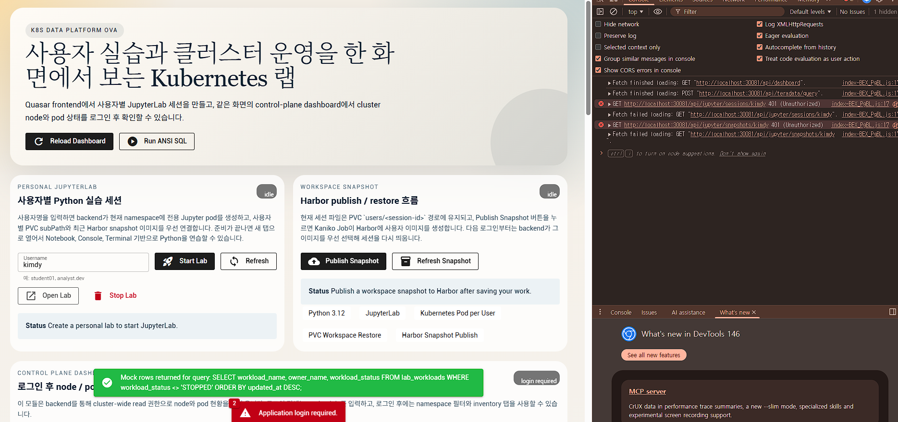

---

## 💖 Sponsor / 후원

이 프로젝트가 도움이 되셨다면 후원을 통해 개발을 지속할 수 있도록 도와주세요.

[](https://github.com/sponsors/edumgt)
[](https://buymeacoffee.com/edumgt)

후원금은 다음 목적에 사용됩니다:

- 클라우드 인프라 운영 비용 (CI/CD, 이미지 레지스트리, 테스트 환경)
- 신규 기능 개발 및 유지 관리
- 문서 개선 및 다국어 지원
- 교육 콘텐츠 및 튜토리얼 제작

> 감사합니다! 여러분의 지원이 이 프로젝트를 계속 발전시킬 수 있게 합니다.
