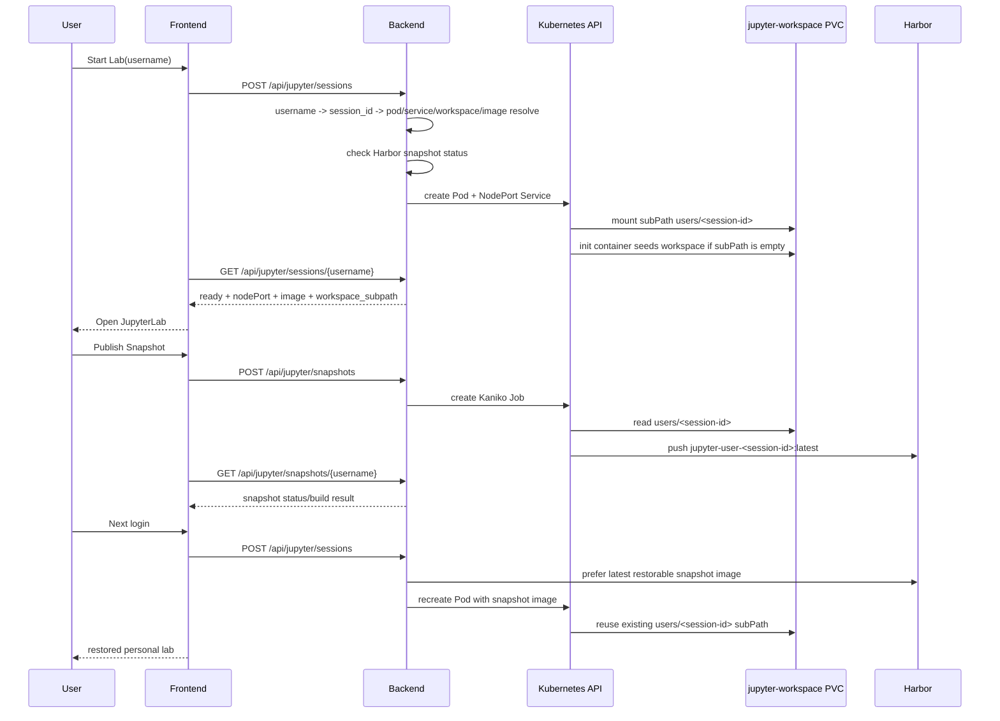

# k8s-data-platform-ova

이 저장소는 `Ubuntu 24 OVA -> k3s single-node Kubernetes -> platform workloads` 구조를 기준으로 만든 실습/운영용 플랫폼입니다. 현재 실행 기준은 Docker Compose 가 아니라 `Kubernetes manifest + kustomize overlay + k3s` 이며, OVA 안에 Docker Engine, k3s, vim, curl, Node.js, Python, 이미지 캐시, 오프라인 번들까지 미리 넣는 방향으로 정리했습니다.

핵심 요구 반영 사항은 아래와 같습니다.

- 사용자별 JupyterLab 세션을 Kubernetes Pod/Service 로 생성
- 사용자별 workspace 를 `PVC subPath` 로 지속화
- workspace 를 Kaniko Job 으로 Harbor snapshot 이미지화
- 다음 로그인 시 Harbor snapshot 이미지를 우선 선택해 재기동
- 플랫폼 공통 이미지는 `docker.io/edumgt/*` 에서 pull
- OVA 내부에 Docker Engine, 기본 유틸리티, 플랫폼 이미지, 오프라인 라이브러리 번들 선탑재

## Kubernetes 구조 확인

현재 구조는 Kubernetes 가 맞습니다.

- 호스트 런타임: `Ubuntu 24`
- 클러스터: `k3s` single-node
- 배포 기준: `infra/k8s/base` + `infra/k8s/overlays/dev|prod`
- 워크로드: `backend`, `frontend`, `mongodb`, `redis`, `airflow`, `jupyter`, `gitlab`, `gitlab-runner`
- 사용자 Jupyter 세션: backend 가 Kubernetes API 로 per-user Pod/Service 생성

즉, 이 저장소는 이미 Kubernetes 중심 구조였고, 이번 변경은 그 위에 `PVC subPath + snapshot publish/restore + registry/offline` 레이어를 보강한 것입니다.

## 구조 요약

```text
.
├── apps/
│   ├── airflow/          # Airflow image + DAG
│   ├── backend/          # FastAPI API + k8s session/snapshot control
│   ├── frontend/         # Quasar(Vue 3) dashboard
│   └── jupyter/          # JupyterLab image + bootstrap workspace
├── ansible/              # OVA guest provisioning, Docker/k3s/bootstrap
├── infra/
│   ├── harbor/           # Harbor snapshot integration notes
│   └── k8s/              # base manifests + dev/prod overlays + runner overlay
├── packer/               # Ubuntu 24 OVA template
└── scripts/              # build/publish/apply/offline helper scripts
```

## 아키텍처 Flowchart

```mermaid
flowchart TD
  A[WSL or build host] --> B[Packer]
  B --> C[Ubuntu 24 OVA]
  C --> D[Ansible provisioning]
  D --> E[Docker Engine + k3s + tools]
  E --> F[Kubernetes single-node cluster]

  F --> G[frontend NodePort 30080]
  F --> H[backend NodePort 30081]
  F --> I[shared jupyter NodePort 30088]
  F --> J[gitlab NodePort 30089]
  F --> K[airflow NodePort 30090]
  F --> L[mongodb + redis + pvc]

  H --> M[per-user session manager]
  M --> N[user Jupyter Pod/Service]
  N --> O[PVC subPath users/<session-id>]
  O --> P[Kaniko snapshot Job]
  P --> Q[Harbor user snapshot image]
  Q --> M

  R[docker.io/edumgt/*] --> F
  S[/opt/k8s-data-platform/offline-bundle] --> F
```

## Jupyter Snapshot Sequence



## 사용자별 세션 규칙

공통 식별자 규칙은 [apps/backend/app/services/lab_identity.py](/home/Kubernetes-OVA-SRE-Archi/apps/backend/app/services/lab_identity.py) 에 모았습니다.

- `username` 정규화
- `session_id` 생성
- `pod_name`
- `service_name`
- `workspace_subpath`
- Harbor snapshot image 경로

이 규칙을 바탕으로:

- [apps/backend/app/services/jupyter_sessions.py](/home/Kubernetes-OVA-SRE-Archi/apps/backend/app/services/jupyter_sessions.py)
  가 Pod/Service/PVC mount 를 관리하고,
- [apps/backend/app/services/jupyter_snapshots.py](/home/Kubernetes-OVA-SRE-Archi/apps/backend/app/services/jupyter_snapshots.py)
  가 Kaniko snapshot publish/status/restore image 선택을 담당합니다.

## 이미지 전략

플랫폼 기본 이미지와 서드파티 런타임 이미지는 모두 `docker.io/edumgt/*` 기준으로 맞췄습니다.

- platform app images
  - `docker.io/edumgt/k8s-data-platform-backend:latest`
  - `docker.io/edumgt/k8s-data-platform-frontend:latest`
  - `docker.io/edumgt/k8s-data-platform-airflow:latest`
  - `docker.io/edumgt/k8s-data-platform-jupyter:latest`
- mirrored runtime/base images
  - `docker.io/edumgt/platform-python:*`
  - `docker.io/edumgt/platform-node:*`
  - `docker.io/edumgt/platform-nginx:*`
  - `docker.io/edumgt/platform-mongodb:*`
  - `docker.io/edumgt/platform-redis:*`
  - `docker.io/edumgt/platform-gitlab-ce:*`
  - `docker.io/edumgt/platform-gitlab-runner:*`
  - `docker.io/edumgt/platform-kaniko-executor:*`

Harbor 는 플랫폼 공통 이미지 레지스트리가 아니라 `per-user Jupyter snapshot registry` 로만 사용합니다.

## 빠른 시작

### 1. OVA 변수 준비

```bash
cp packer/variables.pkr.hcl.example packer/variables.pkr.hcl
```

### 2. OVA 빌드

```bash
bash scripts/run_wsl.sh --skip-export
```

OVA export 까지 한 번에 진행하려면:

```bash
bash scripts/run_wsl.sh
```

### 3. Docker Hub mirror + local k3s import

로컬 Docker login 상태를 사용해서 `edumgt` 네임스페이스 기준으로 support/app 이미지를 정리합니다.

```bash
bash scripts/build_k8s_images.sh --namespace edumgt --tag latest
```

Docker Hub push 까지 하려면:

```bash
docker login
bash scripts/publish_dockerhub.sh --namespace edumgt --tag latest
```

### 4. Kubernetes 적용

```bash
bash scripts/apply_k8s.sh --env dev
```

초기화 후 재적용:

```bash
bash scripts/reset_k8s.sh --env dev
bash scripts/apply_k8s.sh --env dev
```

상태 확인:

```bash
bash scripts/status_k8s.sh --env dev
```

### 5. GitLab Runner overlay

```bash
bash scripts/apply_k8s.sh --env dev --with-runner
kubectl scale deployment/gitlab-runner -n data-platform-dev --replicas=1
```

## Frontend / API

- Frontend 에서 username 입력 후 `Start Lab`
- Backend API:
  - `POST /api/jupyter/sessions`
  - `GET /api/jupyter/sessions/{username}`
  - `DELETE /api/jupyter/sessions/{username}`
  - `GET /api/jupyter/snapshots/{username}`
  - `POST /api/jupyter/snapshots`

Frontend 는 세션 상태와 snapshot 상태를 분리해서 보여주며, 현재 launch image 와 workspace subPath 도 같이 노출합니다.

## 폐쇄망 / OVA 준비

OVA provisioning 시 아래 항목을 미리 넣도록 구성했습니다.

- Docker Engine
- k3s
- Python 3.12 tooling
- Node.js 22
- vim, curl, git, jq, rsync, zip, unzip, wget
- `/opt/k8s-data-platform/scripts`
- `/opt/k8s-data-platform/docs`
- platform/app images preload
- `/opt/k8s-data-platform/offline-bundle`

오프라인 번들을 수동으로 다시 만들려면:

```bash
bash scripts/prepare_offline_bundle.sh --out-dir dist/offline-bundle
```

번들 내용:

- `images/`: Docker/Kubernetes import 용 tar archives
- `wheels/`: backend/jupyter/airflow Python wheel cache
- `npm-cache/`: frontend npm cache
- `frontend-package-lock.json`: frontend offline rebuild 기준 lockfile

## GitHub Actions

변경된 컨테이너 자산을 Docker Hub 로 보내는 workflow 를 추가했습니다.

- workflow: [.github/workflows/publish-images.yml](/home/Kubernetes-OVA-SRE-Archi/.github/workflows/publish-images.yml)
- required secrets:
  - `DOCKERHUB_USERNAME`
  - `DOCKERHUB_TOKEN`

검증 workflow 는 새 스크립트까지 shell syntax 검사를 수행합니다.

## Git Hooks

대용량 산출물과 오프라인 번들이 다시 커밋에 섞이지 않도록 repo 전용 `pre-commit` 훅을 추가했습니다.

한 번만 설치하면 됩니다.

```bash
bash scripts/install_git_hooks.sh
```

이 훅은 아래 항목을 커밋 단계에서 차단합니다.

- `.tmp-k8s-images/*`
- `dist/offline-bundle/*`
- `packer/output-*/*`
- `*.tar`, `*.tar.gz`, `*.tgz`, `*.zip`, `*.whl`
- `*.ova`, `*.qcow2`, `*.vmdk`, `*.vdi`
- 50 MiB 이상으로 stage 된 파일

## 주요 NodePort

- Frontend: `30080`
- Backend API: `30081`
- JupyterLab: `30088`
- GitLab Web: `30089`
- Airflow: `30090`
- GitLab SSH: `30224`

## 주요 파일

- OVA template: [packer/k8s-data-platform.pkr.hcl](/home/Kubernetes-OVA-SRE-Archi/packer/k8s-data-platform.pkr.hcl)
- Ansible playbook: [ansible/playbook.yml](/home/Kubernetes-OVA-SRE-Archi/ansible/playbook.yml)
- Docker runtime role: [ansible/roles/container_runtime/tasks/main.yml](/home/Kubernetes-OVA-SRE-Archi/ansible/roles/container_runtime/tasks/main.yml)
- Platform bootstrap: [ansible/roles/platform_bootstrap/tasks/main.yml](/home/Kubernetes-OVA-SRE-Archi/ansible/roles/platform_bootstrap/tasks/main.yml)
- Base k8s manifests: [infra/k8s/base/kustomization.yaml](/home/Kubernetes-OVA-SRE-Archi/infra/k8s/base/kustomization.yaml)
- Session controller: [apps/backend/app/services/jupyter_sessions.py](/home/Kubernetes-OVA-SRE-Archi/apps/backend/app/services/jupyter_sessions.py)
- Snapshot controller: [apps/backend/app/services/jupyter_snapshots.py](/home/Kubernetes-OVA-SRE-Archi/apps/backend/app/services/jupyter_snapshots.py)
- Frontend dashboard: [apps/frontend/src/App.vue](/home/Kubernetes-OVA-SRE-Archi/apps/frontend/src/App.vue)
- Local build/publish: [scripts/build_k8s_images.sh](/home/Kubernetes-OVA-SRE-Archi/scripts/build_k8s_images.sh)
- Offline bundle: [scripts/prepare_offline_bundle.sh](/home/Kubernetes-OVA-SRE-Archi/scripts/prepare_offline_bundle.sh)
